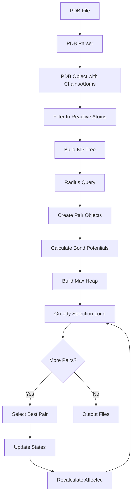

## Codebase Structure

LNKD is organized into modular Python packages with clear separation of concerns.

```
pair_prediction/
├── tools/
│   ├── predict_bonds.py          # Main prediction engine
│   ├── predict_polymerization.py # Radical-specific logic
│   ├── pdb.py                     # PDB parsing and structure
│   ├── utils.py                   # Helper functions
│   └── pair.py                    # Pair object definition
├── predict_for_single_surfactant.py  # CLI entry point
└── README.md
```

---

## Architectural Layers

### Layer 1: Command-Line Interface

**File**: `predict_for_single_surfactant.py`

**Responsibilities**:
- Parse command-line arguments
- Validate input files
- Dispatch to appropriate prediction mode
- Write output files

**Example**:
```python
# CLI entry point
if __name__ == "__main__":
    args = parse_arguments()

    if args.core_reactive_file:
        predictor = PolymerizationPredictor(args.pdb_file, ...)
        predictor.predict_core()

    if args.surface_reactive_file:
        predictor = BondPredictor(args.pdb_file, ...)
        predictor.predict_surface()
```

---

### Layer 2: Prediction Engines

**Files**: `predict_bonds.py`, `predict_polymerization.py`

**Responsibilities**:
- Implement prediction algorithms
- Manage KD-tree construction and queries
- Calculate bond potentials
- Execute greedy selection loop

**Key classes**:
- `BondPredictor`: General cross-linking prediction
- `PolymerizationPredictor`: Extends for radical chemistry (finds unpaired radicals)

---

### Layer 3: Data Structures

**File**: `pdb.py`

**Responsibilities**:
- Parse PDB files
- Represent molecular structures
- Track bonding state

**Key classes**:
- `PDB`: Top-level structure container
- `Chain`: Polymer chain (DVB molecule, surfactant, etc.)
- `Atom`: Individual atom with coordinates and bonding state

---

### Layer 4: Core Algorithms

**Files**: `utils.py`, `pair.py`

**Responsibilities**:
- KD-tree spatial queries
- Distance calculations
- Pair filtering and ranking
- Bond potential calculation

**Key functions**:
- `atoms_to_coords()`: Convert atoms to NumPy arrays
- `remove_1st_and_chain()`: Filter same-chain pairs
- `bond_potential()`: Calculate probability scores

---

## Data Flow



**Key transformations**:
1. **Text → Objects**: PDB file → Python objects
2. **Objects → Arrays**: Atom list → NumPy coordinates
3. **Arrays → Tree**: Coordinates → KD-tree
4. **Tree → Pairs**: Neighbors → Pair objects
5. **Pairs → Predictions**: Greedy selection → Output files

---

## Core Classes

### PDB Class

**Purpose**: Container for entire molecular structure

**Location**: `tools/pdb.py:20-180`

```python
class PDB:
    def __init__(self, filename):
        self.filename = filename
        self.chains = {}       # Chain_ID → Chain object
        self.radicals = []     # Unpaired atoms (polymerization)

    def parse(self):
        """Parse PDB file into chains and atoms"""

    def add_pair(self, pair):
        """Add bonded pair to results"""

    def add_radical(self, atom):
        """Track unpaired radical atoms"""
```

**Key attributes**:
- `chains`: Dictionary mapping chain IDs to Chain objects
- `radicals`: List of Atom objects that didn't find partners
- `pairs`: List of selected Pair objects

---

### Chain Class

**Purpose**: Represents single polymer molecule

**Location**: `tools/pdb.py:185-250`

```python
class Chain:
    def __init__(self, chain_id, chain_type):
        self.chain_id = chain_id        # e.g., "A", "B", ...
        self.chain_type = chain_type    # e.g., "DVO" (DVB)
        self.atoms = {}                 # Atom_name → Atom object
        self.bonded_chains = set()      # IDs of chains bonded to this one

    def add_bonded_chain(self, other_chain_id):
        """Record external bonding to another chain"""
        self.bonded_chains.add(other_chain_id)

    def get_connectivity(self, max_connectivity=8):
        """Return isolatedness score"""
        return max_connectivity - len(self.bonded_chains)
```

**Key methods**:
- `add_bonded_chain()`: Update bonding state
- `get_connectivity()`: Calculate isolatedness for bond potential

---

### Atom Class

**Purpose**: Individual atom with spatial and chemical properties

**Location**: `tools/pdb.py:255-310`

```python
class Atom:
    def __init__(self, serial, name, coords, chain_id):
        self.serial = serial            # Atom index (1-indexed)
        self.name = name                # Atom name (e.g., "CU", "CV")
        self.coords = coords            # [x, y, z] in Angstroms
        self.chain_id = chain_id        # Parent chain ID
        self.is_bonded_external = False # Bonded to other chain?

    def distance_to(self, other_atom):
        """Euclidean distance to another atom"""
        return np.linalg.norm(self.coords - other_atom.coords)
```

**Key attributes**:
- `is_bonded_external`: Boolean flag for greedy selection
- `coords`: NumPy array for vectorized calculations

---

### Pair Class

**Purpose**: Represents candidate or selected bond

**Location**: `tools/pair.py:10-80`

```python
class Pair:
    def __init__(self, atom1, atom2, distance=None):
        self.atom1 = atom1
        self.atom2 = atom2
        self.distance = distance or atom1.distance_to(atom2)
        self.probability = 0.0  # Bond potential (set later)

    def update_probability(self, new_prob):
        """Update bond potential after state change"""
        self.probability = new_prob

    def to_output_string(self):
        """Format for output file"""
        return f"{self.atom1.serial} {self.atom2.serial}"
```

**Usage**:
- Created for all candidate pairs after KD-tree query
- Stored in max heap during greedy selection
- Selected pairs written to output

---

## Prediction Workflows

### Surface Cross-Linking (Click Chemistry)

<Steps>
  <Step title="Initialize">
    ```python
    predictor = BondPredictor(
        pdb_file='micelle.pdb',
        reactive_file='sur_reactive.txt',
        query_radius=15.0,
        isolation_weight=0.03
    )
    ```
  </Step>

  <Step title="Filter Reactive Atoms">
    ```python
    # Parse reactive definitions
    reactive_dict = predictor.get_reactive_str_representation('sur_reactive.txt')

    # Filter PDB atoms
    predictor.init_reactive_atoms(reactive_dict)
    # Result: ~50-100 azide/alkyne atoms
    ```
  </Step>

  <Step title="Build KD-Tree">
    ```python
    coords = atoms_to_coords(predictor.reactive_atoms)
    tree = KDTree(coords, leaf_size=30)
    ```
  </Step>

  <Step title="Query Neighbors">
    ```python
    indices, distances = tree.query_radius(
        coords,
        r=predictor.query_radius,
        return_distance=True
    )
    ```
  </Step>

  <Step title="Create Pairs">
    ```python
    pairs = predictor.initialize_potential_pairs(indices, distances)
    # Each pair gets bond potential calculated
    ```
  </Step>

  <Step title="Greedy Selection">
    ```python
    heap = predictor.init_prob_heap()
    predictor.bond_selection_loop()
    # Iteratively selects best pairs
    ```
  </Step>

  <Step title="Output">
    ```python
    predictor.write_output('surface_pair_output.txt')
    ```
  </Step>
</Steps>

---

### Core Cross-Linking (Radical Polymerization)

**Extension of surface workflow** with additional radical tracking:

```python
class PolymerizationPredictor(BondPredictor):
    def __init__(self, *args, **kwargs):
        super().__init__(*args, **kwargs)
        self.radicals = []

    def find_radicals(self, reactive_atoms_dict):
        """
        Find unpaired vinyl carbons.

        Vinyl groups have 2 carbons (CU, CV).
        If one bonds but other doesn't → radical.
        """
        for chain_id, chain in self.pdb.chains.items():
            for atom_name, atom in chain.atoms.items():
                if atom_name == 'CU':
                    # Find paired CV
                    cv_partner = chain.atoms.get('CV')

                    if atom.is_bonded_external and not cv_partner.is_bonded_external:
                        self.radicals.append(cv_partner)
```

**Additional output**: `radical_output.txt` with unpaired atom serials

---

## Algorithm Implementation

### Bond Potential Calculation

**Location**: `tools/utils.py:95-110`

```python
def bond_potential(atom_dist, dist_equilibrium, dist_variance,
                   iso_weight, isolatedness, Cmax):
    """
    Calculate bond potential for a pair.

    Args:
        atom_dist: Distance between atoms (Å)
        dist_equilibrium: Ideal bond distance (3.0 Å)
        dist_variance: Variance (6.25)
        iso_weight: Weight for isolatedness term (0.03)
        isolatedness: I_A + I_B (0 to 16)
        Cmax: Max connectivity (8)

    Returns:
        Bond potential (0 to ~1)
    """
    gaussian = np.exp(-((atom_dist - dist_equilibrium) ** 2) / (2 * dist_variance))

    numerator = gaussian + (iso_weight * isolatedness)
    denominator = 1 + iso_weight * Cmax

    return numerator / denominator
```

**Called for every pair** during initialization and after state updates

---

### Greedy Selection Loop

**Location**: `tools/predict_bonds.py:200-280`

```python
def bond_selection_loop(self):
    """
    Main algorithm: iteratively select best pairs.
    """
    while self.probability_heap:
        # Pop highest probability
        neg_prob, pair_idx, best_pair = heapq.heappop(self.probability_heap)
        probability = -neg_prob

        # Termination
        if probability < 0.001:
            break

        # Check if still valid (atoms might be bonded already)
        if best_pair.atom1.is_bonded_external or best_pair.atom2.is_bonded_external:
            continue

        # Accept pair
        self.pdb.add_pair(best_pair)

        # Mark atoms as bonded
        best_pair.atom1.is_bonded_external = True
        best_pair.atom2.is_bonded_external = True

        # Update chain connectivity
        chain1 = self.pdb.chains[best_pair.atom1.chain_id]
        chain2 = self.pdb.chains[best_pair.atom2.chain_id]
        chain1.add_bonded_chain(chain2.chain_id)
        chain2.add_bonded_chain(chain1.chain_id)

        # Recalculate affected pairs
        affected = self.find_affected_pairs(best_pair)
        for pair in affected:
            new_prob = self.calculate_bond_potential(pair)
            pair.update_probability(new_prob)
            heapq.heappush(self.probability_heap, (-new_prob, len(self.pairs), pair))
```

**Key optimizations**:
- Lazy deletion (check validity when popped)
- Only recalculate affected pairs (not all pairs)
- Use heap for O(log n) best-pair access

---

## Performance Characteristics

### Time Complexity

| Operation | Complexity | Scaling Behavior |
|-----------|------------|------------------|
| PDB parsing | O(n) | Linear |
| KD-tree build | O(n log n) | Logarithmic |
| Radius queries | O(n log n) | Logarithmic |
| Pair creation | O(kn) | Linear in neighbors |
| Heap build | O(kn) | Linear in neighbors |
| Selection loop | O(m log n) | Logarithmic per selection |
| **Total** | **O(n log n)** | **Logarithmic** |

Where:
- n = reactive atoms
- k = avg neighbors per atom (typically 10-20 with r=10-15 Å)
- m = pairs selected (~400)

---

### Space Complexity

| Data Structure | Size | Memory (n=780) |
|----------------|------|----------------|
| Atom objects | O(n) | ~100 KB |
| Coordinate array | O(n) | ~20 KB |
| KD-tree | O(n) | ~50 KB |
| Pair objects | O(kn) | ~1.5 MB |
| Heap | O(kn) | ~1.5 MB |
| **Total** | **O(kn)** | **~3.2 MB** |

**Memory footprint**: Negligible (runs on laptop)

---

## Extension Points

### Adding New Reaction Types

**Current**: Click chemistry (surface), radical polymerization (core)

**To add** (e.g., Diels-Alder cycloaddition):

<Steps>
  <Step title="Define Reactive Atoms">
    Create reactive atom definitions for diene and dienophile
  </Step>

  <Step title="Adjust Bond Potential">
    Modify distance equilibrium and variance for Diels-Alder geometry

    ```python
    def bond_potential_diels_alder(atom_dist, ...):
        dist_equilibrium = 2.5  # Closer for cycloaddition
        dist_variance = 4.0     # Tighter distribution
        # ... rest of calculation
    ```
  </Step>

  <Step title="Custom Selection Logic">
    Override selection loop if special constraints (e.g., stereochemistry)

    ```python
    class DielsAlderPredictor(BondPredictor):
        def bond_selection_loop(self):
            # Custom logic for stereoselective pairing
            pass
    ```
  </Step>
</Steps>

---

### Integrating with Other MD Packages

**Current**: Outputs for GROMACS (topology, PLUMED)

**To support** (e.g., AMBER, NAMD):

```python
class TopologyWriter:
    """Abstract base for topology generation"""

    def write_bonds(self, pairs, output_file):
        raise NotImplementedError

class GromacsTopologyWriter(TopologyWriter):
    def write_bonds(self, pairs, output_file):
        with open(output_file, 'w') as f:
            f.write("[ bonds ]\n")
            for pair in pairs:
                f.write(f"{pair.atom1.serial} {pair.atom2.serial} 1 0.153 300000\n")

class AmberTopologyWriter(TopologyWriter):
    def write_bonds(self, pairs, output_file):
        # AMBER prmtop format
        pass
```

---

## Design Patterns Used

<AccordionGroup>
  <Accordion title="1. Template Method Pattern">
    **Where**: `BondPredictor` → `PolymerizationPredictor`

    **Purpose**: Base class defines algorithm structure, subclass customizes steps

    **Example**:
    ```python
    class BondPredictor:
        def predict(self):
            self.parse_pdb()
            self.filter_reactive()
            self.build_tree()
            self.select_pairs()  # Template method

    class PolymerizationPredictor(BondPredictor):
        def select_pairs(self):
            super().select_pairs()
            self.find_radicals()  # Additional step
    ```
  </Accordion>

  <Accordion title="2. Strategy Pattern">
    **Where**: Bond potential calculation

    **Purpose**: Algorithm can be swapped without changing caller

    **Example**:
    ```python
    def calculate_bond_potential(self, pair, strategy='default'):
        if strategy == 'default':
            return bond_potential(...)
        elif strategy == 'diels_alder':
            return bond_potential_diels_alder(...)
    ```
  </Accordion>

  <Accordion title="3. Lazy Evaluation">
    **Where**: Greedy selection loop

    **Purpose**: Defer expensive recalculations until necessary

    **Example**:
    - Don't remove invalidated pairs from heap immediately
    - Check validity when popped
    - Avoids O(n) heap rebuild operations
  </Accordion>
</AccordionGroup>

---

## Testing Strategy

**Current testing**: Manual validation via example structures

**Recommended additions**:

<Tabs>
  <Tab title="Unit Tests">
    ```python
    # tests/test_bond_potential.py
    def test_bond_potential_at_equilibrium():
        """Potential should be maximal at equilibrium distance"""
        p = bond_potential(
            atom_dist=3.0,
            dist_equilibrium=3.0,
            dist_variance=6.25,
            iso_weight=0.03,
            isolatedness=16,
            Cmax=8
        )
        assert p > 0.95  # Near maximum

    def test_bond_potential_far_distance():
        """Potential should decay at large distances"""
        p = bond_potential(atom_dist=15.0, ...)
        assert p < 0.01
    ```
  </Tab>

  <Tab title="Integration Tests">
    ```python
    # tests/test_prediction.py
    def test_small_system_prediction():
        """Predict bonds for 10-chain system"""
        predictor = BondPredictor('test_10chain.pdb', ...)
        predictor.predict()

        # Should find ~15-20 pairs
        assert 15 <= len(predictor.pdb.pairs) <= 20
    ```
  </Tab>

  <Tab title="Regression Tests">
    ```python
    # tests/test_regression.py
    def test_glycosidase_example():
        """Reproduce glycosidase case study results"""
        predictor = BondPredictor('glycosidase.pdb', ...)
        predictor.predict()

        # Known results from paper
        assert len(predictor.pdb.pairs) == 118  # Iteration 2
    ```
  </Tab>
</Tabs>

---

## Next Steps

<CardGroup cols={2}>
  <Card title="Core Classes" icon="cube" href="/developer/architecture/core-classes">
    Detailed API for PDB, Chain, Atom, Pair
  </Card>

  <Card title="Design Decisions" icon="lightbulb" href="/developer/architecture/design-decisions">
    Why LNKD is structured this way
  </Card>

  <Card title="API: Predict Bonds" icon="code" href="/developer/api/api-predict-bonds">
    Full reference for prediction engines
  </Card>

  <Card title="Extending LNKD" icon="puzzle-piece" href="/developer/extending/extending-reactions">
    Add custom reaction types
  </Card>
</CardGroup>
