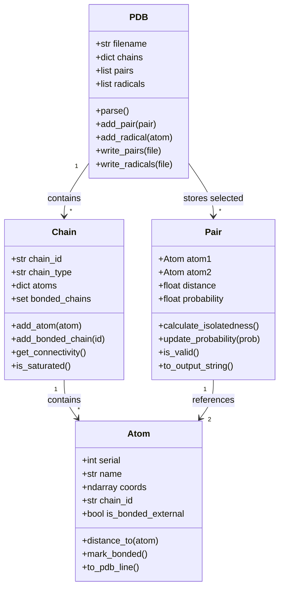
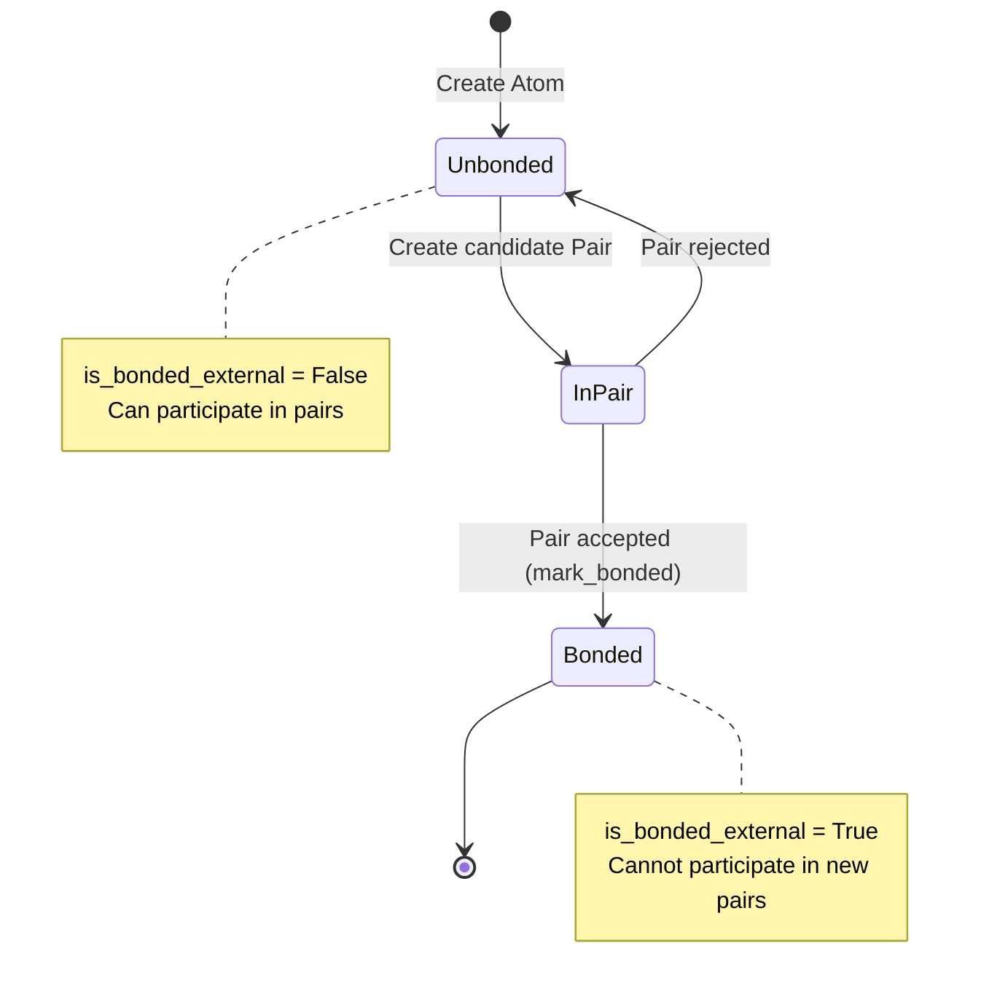

## Overview

LNKD's data model consists of four core classes arranged hierarchically:

```
PDB (structure)
└── Chain (polymer molecule)
    └── Atom (individual atom)

Pair (bond between two atoms)
```

---

## PDB Class

**Location**: `pair_prediction/tools/pdb.py:20-180`

**Purpose**: Top-level container representing entire molecular structure.

### Constructor

```python
class PDB:
    def __init__(self, filename):
        """
        Initialize PDB structure from file.

        Args:
            filename (str): Path to PDB file

        Attributes:
            filename (str): Original PDB file path
            chains (dict): Chain_ID → Chain object mapping
            pairs (list): Selected Pair objects
            radicals (list): Unpaired Atom objects (polymerization only)
        """
        self.filename = filename
        self.chains = {}
        self.pairs = []
        self.radicals = []
```

---

### Methods

<Tabs>
  <Tab title="parse()">
    ```python
    def parse(self):
        """
        Parse PDB file and populate chains/atoms.

        Parsing logic:
        1. Read ATOM/HETATM lines
        2. Extract chain ID, residue name, atom name, coordinates
        3. Create Chain objects for unique chain IDs
        4. Create Atom objects and add to parent Chain

        Returns:
            None (modifies self.chains in-place)

        Raises:
            FileNotFoundError: If PDB file doesn't exist
            ValueError: If PDB format is invalid

        Example:
            >>> pdb = PDB('structure.pdb')
            >>> pdb.parse()
            >>> print(len(pdb.chains))
            120  # 120 polymer chains
        ```

    **PDB line format**:
    ```
    ATOM   serial name resName chainID resSeq x      y      z
    ATOM   1      CU   DVO     A       1      12.345 6.789  0.123
    ```
  </Tab>

  <Tab title="add_pair()">
    ```python
    def add_pair(self, pair):
        """
        Add bonded pair to results.

        Called during greedy selection loop for each accepted pair.

        Args:
            pair (Pair): Pair object with atom1, atom2, probability

        Returns:
            None (appends to self.pairs)

        Side effects:
            - Updates pair.atom1.is_bonded_external = True
            - Updates pair.atom2.is_bonded_external = True
            - Updates chain connectivity via add_bonded_chain()

        Example:
            >>> pair = Pair(atom1, atom2)
            >>> pdb.add_pair(pair)
            >>> print(len(pdb.pairs))
            1
        ```
  </Tab>

  <Tab title="add_radical()">
    ```python
    def add_radical(self, atom):
        """
        Track unpaired radical atom (polymerization only).

        Used when vinyl carbon doesn't find bonding partner.

        Args:
            atom (Atom): Unpaired atom object

        Returns:
            None (appends to self.radicals)

        Example:
            >>> atom = chain.atoms['CU']
            >>> if not atom.is_bonded_external:
            ...     pdb.add_radical(atom)
            >>> print(len(pdb.radicals))
            76  # 76 unpaired vinyl carbons
        ```
  </Tab>

  <Tab title="write_pairs()">
    ```python
    def write_pairs(self, output_file):
        """
        Write bonded pairs to file.

        Output format: One pair per line (atom serials)
        59 1054
        4602 5222
        ...

        Args:
            output_file (str): Path to output file

        Returns:
            None (writes to disk)

        Example:
            >>> pdb.write_pairs('surface_pair_output.txt')
        ```
  </Tab>

  <Tab title="write_radicals()">
    ```python
    def write_radicals(self, output_file):
        """
        Write unpaired radicals to file.

        Output format: One atom serial per line
        4502
        4642
        ...

        Args:
            output_file (str): Path to radical output file

        Returns:
            None (writes to disk)

        Example:
            >>> pdb.write_radicals('radical_output.txt')
        ```
  </Tab>
</Tabs>

---

### Usage Example

```python
# Initialize and parse
pdb = PDB('micelle_relaxed.pdb')
pdb.parse()

# Access structure
print(f"Total chains: {len(pdb.chains)}")

# Iterate over chains
for chain_id, chain in pdb.chains.items():
    print(f"Chain {chain_id}: {chain.chain_type}, {len(chain.atoms)} atoms")

# After prediction
print(f"Bonded pairs: {len(pdb.pairs)}")
print(f"Radicals: {len(pdb.radicals)}")

# Write outputs
pdb.write_pairs('pairs.txt')
pdb.write_radicals('radicals.txt')
```

---

## Chain Class

**Location**: `pair_prediction/tools/pdb.py:185-250`

**Purpose**: Represents single polymer molecule (DVB, surfactant, etc.).

### Constructor

```python
class Chain:
    def __init__(self, chain_id, chain_type):
        """
        Initialize polymer chain.

        Args:
            chain_id (str): PDB chain identifier (e.g., "A", "B", ...)
            chain_type (str): Residue name (e.g., "DVO", "SUR", "MON")

        Attributes:
            chain_id (str): Unique identifier
            chain_type (str): Chemical type/residue name
            atoms (dict): Atom_name → Atom object mapping
            bonded_chains (set): Set of chain IDs bonded to this chain
        """
        self.chain_id = chain_id
        self.chain_type = chain_type
        self.atoms = {}
        self.bonded_chains = set()
```

---

### Methods

<Tabs>
  <Tab title="add_atom()">
    ```python
    def add_atom(self, atom):
        """
        Add atom to chain.

        Args:
            atom (Atom): Atom object to add

        Returns:
            None (adds to self.atoms dictionary)

        Example:
            >>> chain = Chain("A", "DVO")
            >>> atom = Atom(serial=1, name="CU", coords=[1,2,3], chain_id="A")
            >>> chain.add_atom(atom)
            >>> print(len(chain.atoms))
            1
        ```
  </Tab>

  <Tab title="add_bonded_chain()">
    ```python
    def add_bonded_chain(self, other_chain_id):
        """
        Record external bonding to another chain.

        Called when a pair is selected that bonds this chain to another.

        Args:
            other_chain_id (str): ID of bonded chain

        Returns:
            None (updates self.bonded_chains set)

        Side effects:
            - Changes isolatedness score (affects future bond potentials)

        Example:
            >>> chain_A.add_bonded_chain("B")
            >>> chain_A.add_bonded_chain("C")
            >>> print(len(chain_A.bonded_chains))
            2  # Bonded to chains B and C
        ```
  </Tab>

  <Tab title="get_connectivity()">
    ```python
    def get_connectivity(self, max_connectivity=8):
        """
        Calculate isolatedness score for bond potential.

        Isolatedness = Cmax - current_connectivity

        Args:
            max_connectivity (int): Maximum allowed bonds (default: 8)

        Returns:
            int: Isolatedness score (0 to max_connectivity)

        Example:
            >>> chain.add_bonded_chain("B")
            >>> chain.add_bonded_chain("C")
            >>> print(chain.get_connectivity(max_connectivity=8))
            6  # 8 - 2 = 6 (high isolatedness)
        ```

    **Relationship to bond potential**:
    $$I_{\text{pair}} = I_A + I_B = (C_{max} - \text{bonds}_A) + (C_{max} - \text{bonds}_B)$$
  </Tab>

  <Tab title="is_saturated()">
    ```python
    def is_saturated(self, max_connectivity=8):
        """
        Check if chain has reached maximum bonding capacity.

        Returns:
            bool: True if len(bonded_chains) >= max_connectivity

        Example:
            >>> chain.bonded_chains = {"A", "B", "C", "D", "E", "F", "G", "H"}
            >>> print(chain.is_saturated(max_connectivity=8))
            True  # Cannot bond to more chains
        ```
  </Tab>
</Tabs>

---

### Usage Example

```python
# Create chain
chain = Chain(chain_id="A", chain_type="DVO")

# Add atoms
for i, coords in enumerate([[1,2,3], [4,5,6]]):
    atom = Atom(serial=i+1, name=f"C{i}", coords=coords, chain_id="A")
    chain.add_atom(atom)

# Track bonding
chain.add_bonded_chain("B")
chain.add_bonded_chain("C")

# Check state
print(f"Connectivity: {8 - chain.get_connectivity(8)}")  # 2 bonds
print(f"Saturated: {chain.is_saturated(8)}")  # False (can bond more)
```

---

## Atom Class

**Location**: `pair_prediction/tools/pdb.py:255-310`

**Purpose**: Individual atom with spatial coordinates and bonding state.

### Constructor

```python
class Atom:
    def __init__(self, serial, name, coords, chain_id):
        """
        Initialize atom.

        Args:
            serial (int): Atom index from PDB (1-indexed)
            name (str): Atom name (e.g., "CU", "CV", "N01")
            coords (np.ndarray): [x, y, z] coordinates in Angstroms
            chain_id (str): Parent chain ID

        Attributes:
            serial (int): Unique atom identifier
            name (str): Atom type/name
            coords (np.ndarray): 3D position
            chain_id (str): Parent chain reference
            is_bonded_external (bool): Bonded to other chain?
        """
        self.serial = serial
        self.name = name
        self.coords = np.array(coords, dtype=float)
        self.chain_id = chain_id
        self.is_bonded_external = False
```

---

### Methods

<Tabs>
  <Tab title="distance_to()">
    ```python
    def distance_to(self, other_atom):
        """
        Calculate Euclidean distance to another atom.

        Args:
            other_atom (Atom): Target atom

        Returns:
            float: Distance in Angstroms

        Example:
            >>> atom1 = Atom(1, "CU", [0, 0, 0], "A")
            >>> atom2 = Atom(2, "CV", [3, 4, 0], "B")
            >>> print(atom1.distance_to(atom2))
            5.0  # sqrt(3^2 + 4^2)
        ```

    **Implementation**:
    ```python
    return np.linalg.norm(self.coords - other_atom.coords)
    ```
  </Tab>

  <Tab title="mark_bonded()">
    ```python
    def mark_bonded(self):
        """
        Mark atom as bonded to external chain.

        Side effects:
            - Sets self.is_bonded_external = True
            - Prevents future pairing in greedy selection

        Example:
            >>> atom.mark_bonded()
            >>> print(atom.is_bonded_external)
            True
        ```
  </Tab>

  <Tab title="to_pdb_line()">
    ```python
    def to_pdb_line(self):
        """
        Format atom as PDB ATOM line.

        Returns:
            str: PDB-formatted line

        Example:
            >>> atom = Atom(1, "CU", [12.345, 6.789, 0.123], "A")
            >>> print(atom.to_pdb_line())
            ATOM      1  CU   DVO A   1      12.345   6.789   0.123  1.00  0.00
        ```

    **PDB format specification**:
    ```
    Columns:
    1-6:   "ATOM  "
    7-11:  Atom serial
    13-16: Atom name
    18-20: Residue name
    22:    Chain ID
    23-26: Residue sequence number
    31-38: X coordinate
    39-46: Y coordinate
    47-54: Z coordinate
    55-60: Occupancy
    61-66: Temperature factor
    ```
  </Tab>
</Tabs>

---

### Usage Example

```python
# Create atoms
atom1 = Atom(serial=59, name="N01", coords=[10.5, 20.3, 15.8], chain_id="A")
atom2 = Atom(serial=1054, name="C14", coords=[13.2, 22.1, 16.5], chain_id="B")

# Calculate distance
dist = atom1.distance_to(atom2)
print(f"Distance: {dist:.2f} Å")  # 3.45 Å

# Mark as bonded
atom1.mark_bonded()
atom2.mark_bonded()

# Check state
print(f"Atom 1 bonded: {atom1.is_bonded_external}")  # True
print(f"Atom 2 bonded: {atom2.is_bonded_external}")  # True
```

---

## Pair Class

**Location**: `pair_prediction/tools/pair.py:10-80`

**Purpose**: Represents candidate or selected bond between two atoms.

### Constructor

```python
class Pair:
    def __init__(self, atom1, atom2, distance=None):
        """
        Initialize atom pair.

        Args:
            atom1 (Atom): First atom
            atom2 (Atom): Second atom
            distance (float, optional): Pre-calculated distance.
                                        If None, calculates from atoms.

        Attributes:
            atom1 (Atom): First atom reference
            atom2 (Atom): Second atom reference
            distance (float): Euclidean distance (Å)
            probability (float): Bond potential score (0 to ~1)
        """
        self.atom1 = atom1
        self.atom2 = atom2
        self.distance = distance if distance is not None else atom1.distance_to(atom2)
        self.probability = 0.0  # Set later via calculate_bond_potential()
```

---

### Methods

<Tabs>
  <Tab title="calculate_isolatedness()">
    ```python
    def calculate_isolatedness(self, pdb, max_connectivity=8):
        """
        Calculate combined isolatedness of both chains.

        I = I_A + I_B = (Cmax - bonds_A) + (Cmax - bonds_B)

        Args:
            pdb (PDB): PDB object (for accessing chains)
            max_connectivity (int): Maximum bonds per chain

        Returns:
            int: Isolatedness score (0 to 2*max_connectivity)

        Example:
            >>> chain_A.bonded_chains = {"X"}  # 1 bond
            >>> chain_B.bonded_chains = set()  # 0 bonds
            >>> pair = Pair(atom_from_A, atom_from_B)
            >>> iso = pair.calculate_isolatedness(pdb, max_connectivity=8)
            >>> print(iso)
            15  # (8-1) + (8-0) = 7 + 8 = 15
        ```
  </Tab>

  <Tab title="update_probability()">
    ```python
    def update_probability(self, new_prob):
        """
        Update bond potential after state change.

        Called when chains bond to other chains (isolatedness decreases).

        Args:
            new_prob (float): New probability score

        Returns:
            None (updates self.probability in-place)

        Example:
            >>> pair.probability = 0.85
            >>> # Chain bonds to another → isolatedness drops
            >>> pair.update_probability(0.72)  # Recalculated
            >>> print(pair.probability)
            0.72
        ```
  </Tab>

  <Tab title="is_valid()">
    ```python
    def is_valid(self):
        """
        Check if pair is still valid for bonding.

        Returns:
            bool: True if neither atom is already bonded

        Example:
            >>> pair = Pair(atom1, atom2)
            >>> print(pair.is_valid())
            True
            >>> atom1.mark_bonded()
            >>> print(pair.is_valid())
            False  # atom1 now bonded, pair invalid
        ```

    **Implementation**:
    ```python
    return (not self.atom1.is_bonded_external and
            not self.atom2.is_bonded_external)
    ```
  </Tab>

  <Tab title="to_output_string()">
    ```python
    def to_output_string(self):
        """
        Format pair for output file.

        Returns:
            str: "serial1 serial2" format

        Example:
            >>> pair = Pair(atom1, atom2)  # atom1.serial=59, atom2.serial=1054
            >>> print(pair.to_output_string())
            59 1054
        ```
  </Tab>

  <Tab title="__lt__()">
    ```python
    def __lt__(self, other):
        """
        Less-than comparison for heap ordering.

        Pairs with higher probability come first (max heap via negation).

        Args:
            other (Pair): Pair to compare against

        Returns:
            bool: True if self has lower probability

        Example:
            >>> pair1 = Pair(...)
            >>> pair1.probability = 0.85
            >>> pair2 = Pair(...)
            >>> pair2.probability = 0.72
            >>> print(pair2 < pair1)
            True  # pair2 lower priority
        ```
  </Tab>
</Tabs>

---

### Usage Example

```python
# Create pair
atom1 = Atom(59, "N01", [10, 20, 15], "A")
atom2 = Atom(1054, "C14", [13, 22, 16], "B")
pair = Pair(atom1, atom2)

# Calculate bond potential
from tools.utils import bond_potential

iso = pair.calculate_isolatedness(pdb, max_connectivity=8)
pair.probability = bond_potential(
    atom_dist=pair.distance,
    dist_equilibrium=3.0,
    dist_variance=6.25,
    iso_weight=0.03,
    isolatedness=iso,
    Cmax=8
)

print(f"Distance: {pair.distance:.2f} Å")
print(f"Isolatedness: {iso}")
print(f"Probability: {pair.probability:.3f}")

# Check validity
print(f"Valid: {pair.is_valid()}")  # True (neither atom bonded yet)

# Accept pair
atom1.mark_bonded()
atom2.mark_bonded()
print(f"Valid after bonding: {pair.is_valid()}")  # False
```

---

## Class Relationships



---

## State Machine: Atom Bonding



---

## Next Steps

<CardGroup cols={2}>
  <Card title="Design Decisions" icon="lightbulb" href="/developer/architecture/design-decisions">
    Why these classes are structured this way
  </Card>

  <Card title="API: PDB" icon="code" href="/developer/api/api-pdb">
    Full PDB class API reference
  </Card>

  <Card title="API: Atom & Chain" icon="atom" href="/developer/api/api-atom-chain">
    Complete Atom and Chain documentation
  </Card>

  <Card title="Utilities" icon="wrench" href="/developer/api/api-utilities">
    Helper functions and algorithms
  </Card>
</CardGroup>
