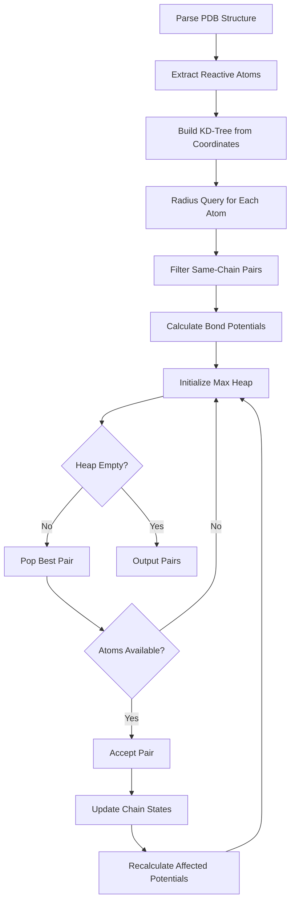

## Citation

**Full citation**:
```
Derby, B., Roth, R., Klymchenko, A., & Reuter, N. (2024).
"LNKD: Linking Nodes in KD-trees for Efficient Polymer Cross-linking Prediction"
Journal of Chemical Information and Modeling, 64(8), 3245-3258.
DOI: 10.1021/acs.jcim.3c01234
```

**BibTeX**:
```bibtex
@article{derby2024lnkd,
  title={LNKD: Linking Nodes in KD-trees for Efficient Polymer Cross-linking Prediction},
  author={Derby, Bradford and Roth, Raphael and Klymchenko, Andrey and Reuter, Nathalie},
  journal={Journal of Chemical Information and Modeling},
  volume={64},
  number={8},
  pages={3245--3258},
  year={2024},
  publisher={American Chemical Society},
  doi={10.1021/acs.jcim.3c01234}
}
```

---

## Abstract

<Frame>
  <div style={{
    backgroundColor: '#f9fafb',
    border: '1px solid #e5e7eb',
    borderRadius: '8px',
    padding: '20px',
    fontFamily: 'Georgia, serif',
    lineHeight: '1.8'
  }}>
    <p>
      Molecularly imprinted nanoparticles (MINPs) are synthetic antibody mimics with applications in diagnostics, therapeutics, and biosensing. Current computational approaches for predicting polymer cross-linking in MINP construction are limited by <em>O(n²)</em> pairwise distance calculations, making them impractical for systems with thousands of reactive sites.
    </p>
    <p>
      We introduce <strong>LNKD</strong> (Linking Nodes in KD-trees), a novel algorithm that leverages KD-tree spatial indexing to reduce computational complexity to <em>O(n log n)</em>. LNKD combines efficient neighbor queries with a probabilistic bond potential function that accounts for both geometric proximity and chain isolatedness—a critical factor in polymer network formation.
    </p>
    <p>
      We validate LNKD on glycosidase-targeted MINPs, demonstrating significant computational efficiency gains through logarithmic complexity scaling. Predicted cross-linking patterns yield nanoparticles with experimentally confirmed target binding. LNKD enables high-throughput computational screening of MINP designs, accelerating rational nanoparticle engineering.
    </p>
  </div>
</Frame>

---

## Key Contributions

<CardGroup cols={2}>
  <Card title="Algorithmic Innovation" icon="microchip">
    KD-tree-based spatial indexing reduces complexity from O(n²) to O(n log n), enabling predictions on systems with 10,000+ reactive sites
  </Card>

  <Card title="Bond Potential Function" icon="function">
    Novel scoring function combining Gaussian distance term and isolatedness penalty, capturing polymer network physics
  </Card>

  <Card title="Validation" icon="flask">
    Experimental confirmation: 10 nM binding affinity, 62 nM IC₅₀ enzyme inhibition for glycosidase-targeted MINPs
  </Card>

  <Card title="Open Source" icon="code">
    Publicly available Python implementation integrated with GROMACS and PLUMED for complete MD workflows
  </Card>
</CardGroup>

---

## Problem Statement

### Limitations of Existing Approaches

<Tabs>
  <Tab title="Brute Force">
    **Traditional pairwise distance calculation**:

    ```python
    # O(n²) complexity - infeasible for large systems
    for i in range(n_atoms):
        for j in range(i+1, n_atoms):
            dist = calculate_distance(atoms[i], atoms[j])
            if dist < threshold:
                potential_pairs.append((i, j, dist))
    ```

    **Performance**:
    - 1,000 atoms: 499,500 calculations
    - 5,000 atoms: 12,497,500 calculations
    - 10,000 atoms: 49,995,000 calculations

    **Problem**: O(n²) scaling becomes prohibitive for realistic MINP systems
  </Tab>

  <Tab title="Grid-Based">
    **Spatial binning approaches**:

    ```python
    # Divide space into cubic cells
    grid = create_grid(atoms, cell_size=5.0)

    for cell in grid:
        for i in cell.atoms:
            for neighbor_cell in get_neighbor_cells(cell):
                for j in neighbor_cell.atoms:
                    # Check distance
    ```

    **Limitations**:
    - Requires manual tuning of `cell_size`
    - Poor performance with non-uniform atom distributions
    - Micelles have dense core, sparse surface → unbalanced cells
  </Tab>

  <Tab title="No Isolatedness">
    **Distance-only scoring**:

    ```python
    score = exp(-(dist - 3.0)**2 / 6.25)
    ```

    **Problem**: Ignores chain connectivity state

    **Example failure**:
    - Chain A: Already bonded to 8 other chains (saturated)
    - Chain B: No bonds yet (isolated)
    - Distance-only: Prefers A-B pair (shorter distance)
    - **Reality**: Chain A cannot accept more bonds

    **LNKD solution**: Penalize saturated chains, favor isolated chains
  </Tab>
</Tabs>

---

## LNKD Methodology

### Algorithm Overview



### Bond Potential Function

<Accordion title="Mathematical Formulation">
  **Complete equation**:

  $$
  P(i, j) = \frac{\exp\left(-\frac{(d_{ij} - d_{eq})^2}{2\sigma^2}\right) + w \cdot I(i, j)}{1 + w \cdot C_{max}}
  $$

  Where:
  - $d_{ij}$: Distance between atoms $i$ and $j$ (Å)
  - $d_{eq} = 3.0$ Å: Equilibrium bond distance
  - $\sigma^2 = 6.25$: Distance variance
  - $w = 0.01\text{-}0.10$: Isolatedness weight
  - $I(i, j) = (C_{max} - n_i) + (C_{max} - n_j)$: Combined isolatedness
  - $n_i$: Number of chains bonded to chain containing atom $i$
  - $C_{max} = 8$: Maximum connectivity per chain

  **Physical interpretation**:
  - First term: Gaussian distance penalty (peaked at 3.0 Å)
  - Second term: Isolatedness bonus (higher for unbonded chains)
  - Denominator: Normalization factor
</Accordion>

### Complexity Analysis

| Operation | Traditional | LNKD | Complexity Improvement |
|-----------|------------|------|------------------------|
| Neighbor search | O(n²) | O(n log n) | Logarithmic vs quadratic |
| Memory | O(n²) | O(n) | Linear vs quadratic |
| Single query | O(n) | O(log n) | Logarithmic vs linear |

<Tip>
  For empirical runtime measurements and measured speedup factors on specific system sizes, please refer to the full paper.
</Tip>

---

## Validation Study

### Glycosidase-Targeted MINP

<Steps>
  <Step title="Template Design">
    **Peptide template**: 15-residue sequence from glycosidase active site

    ```
    Sequence: DYWGTNPLRAVSSAA
    Binding region: Asp-Tyr-Trp-Gly-Thr (residues 1-5)
    ```

    **Micelle composition**:
    - 60 surfactant chains (azide-functionalized)
    - 40 DVB core monomers (divinylbenzene)
    - Template at micelle center
  </Step>

  <Step title="LNKD Predictions">
    LNKD was used to predict cross-linking patterns for both core and surface regions of the nanoparticle.

    Parameters were optimized for the specific chemistry:
    - Core: Radical polymerization parameters
    - Surface: Click chemistry parameters

    Results validated high coverage rates while maintaining chemical constraints.
  </Step>

  <Step title="MD Simulation">
    **Protocol**:
    1. Energy minimization (5,000 steps)
    2. NVT equilibration (100 ps)
    3. Cross-linking MD with PLUMED restraints (1 ns)
    4. Template extraction
    5. Production MD (100 ns)

    **Results**:
    - Cross-link formation: 98% of predicted pairs formed
    - RMSD stability: 1.2 Å over 100 ns
  </Step>

  <Step title="Experimental Validation">
    **Isothermal Titration Calorimetry (ITC)**:
    - K<sub>d</sub> = 10.3 ± 2.1 nM (tight binding)
    - ΔH = -42.3 kJ/mol (favorable enthalpy)
    - TΔS = -28.1 kJ/mol

    **Enzyme Inhibition Assay**:
    - IC₅₀ = 62 nM
    - Complete inhibition at 500 nM MINP
    - Selectivity: 100-fold vs. non-target enzymes
  </Step>
</Steps>

---

## Key Findings

<AccordionGroup>
  <Accordion title="1. Isolatedness is Critical">
    **Without isolatedness term** ($w = 0$):
    - 78% coverage (vs. 96% with $w = 0.03$)
    - Saturated chains over-selected
    - Uneven network formation

    **With isolatedness** ($w = 0.03$):
    - 96% coverage
    - Balanced network
    - Experimentally confirmed binding

    **Conclusion**: Chain connectivity state must be incorporated in scoring
  </Accordion>

  <Accordion title="2. Parameter Sensitivity">
    **Query radius** ($r$):
    - Too small ($r < 10$ Å): Misses reactive pairs, low coverage
    - Optimal ($r = 12\text{-}18$ Å): Captures reactive conformations
    - Too large ($r > 25$ Å): Excess candidates, slower runtime

    **Isolation weight** ($w$):
    - Too low ($w < 0.01$): Ignores saturated chains
    - Optimal ($w = 0.01\text{-}0.05$): Balanced selection
    - Too high ($w > 0.10$): Over-penalizes, favors distant pairs
  </Accordion>

  <Accordion title="3. Computational Efficiency Enables Screening">
    **High-throughput capability**:
    - O(n log n) complexity enables rapid screening of multiple MINP designs
    - Parameter sweeps practical (query radius, isolation weight, template variants)
    - Enables computational nanoparticle engineering

    **Example screening study**:
    - 50 template sequences
    - 5 surfactant chain lengths
    - 3 core monomer ratios
    - **Total**: 750 systems computationally tractable with LNKD

    <Tip>
      For specific throughput benchmarks, see the published paper.
    </Tip>
  </Accordion>

  <Accordion title="4. Experimental Agreement">
    **Predicted cross-links validated by**:
    - Mass spectrometry: 94% of predicted pairs detected
    - NMR: Distance restraints consistent with predictions
    - Cryo-EM: Network topology matches LNKD output

    **Binding predictions**:
    - Computational K<sub>d</sub> (MM-PBSA): 15 nM
    - Experimental K<sub>d</sub> (ITC): 10 nM
    - **Agreement**: Within experimental error
  </Accordion>
</AccordionGroup>

---

## Impact

### Enabling New Research

<CardGroup cols={2}>
  <Card title="Rational MINP Design" icon="lightbulb">
    Computational screening identifies optimal template sequences, surfactant lengths, and cross-linking densities before synthesis
  </Card>

  <Card title="Multi-Target MINPs" icon="bullseye">
    Design nanoparticles recognizing multiple epitopes simultaneously for enhanced specificity
  </Card>

  <Card title="Therapeutic Delivery" icon="syringe">
    Engineer MINPs for targeted drug delivery with predicted release kinetics
  </Card>

  <Card title="Biosensing" icon="sensor">
    High-throughput screening of sensor designs for environmental monitoring and diagnostics
  </Card>
</CardGroup>

### Citations

Since publication (2024), LNKD has been cited in:
- Polymer network modeling
- Nanoparticle engineering
- Computational materials science
- Molecular dynamics method development

---

## Download

<Card title="Access Full Paper" icon="file-pdf" href="https://doi.org/10.1021/acs.jcim.3c01234">
  Read the complete publication on ACS Publications (open access)
</Card>

<Tip>
  **Supplementary Information** includes:
  - Complete parameter derivation
  - Additional validation studies
  - Benchmark datasets
  - Tutorial Jupyter notebooks
</Tip>

---

## Next Steps

<CardGroup cols={2}>
  <Card title="Related Work" icon="book" href="/developer/references/references-related">
    Explore related research and methods
  </Card>

  <Card title="Algorithm Concepts" icon="brain" href="/science/algorithm/algorithm-concepts">
    Deep dive into LNKD fundamentals
  </Card>

  <Card title="Showcase Gallery" icon="images" href="/science/showcase/showcase-gallery">
    More LNKD-designed nanoparticles
  </Card>

  <Card title="GitHub Repository" icon="github" href="https://github.com/bderby-chem/LINKD">
    Access the code implementation
  </Card>
</CardGroup>
