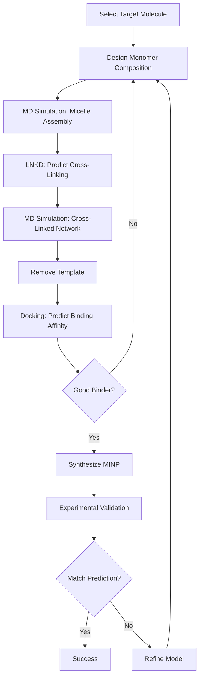

## What is Molecular Imprinting?

**Molecular imprinting** is a technique for creating synthetic receptors with predetermined selectivity for target molecules.

### Core Concept

Create a "molecular memory" in a polymer network by polymerizing monomers around a template molecule, then removing the template to leave a complementary binding site.

**Analogy**: Like making a mold - the template is the "positive" and the binding cavity is the "negative."

---

## Historical Development

<Steps>
  <Step title="1931: Polyakov's Pioneering Work">
    **Mikhail Polyakov** (Soviet Union) reports first molecular imprinting experiments with silica gels.

    - Created silica structures with "memory" of additives
    - Showed selective adsorption after additive removal
    - Mechanism poorly understood at the time
  </Step>

  <Step title="1949: Dickey's Dye Imprinting">
    **Frank Dickey** demonstrates selective binding of dyes in silica.

    - Used methyl orange and other dyes as templates
    - Showed preferential rebinding of template over similar molecules
    - First clear demonstration of molecular recognition
  </Step>

  <Step title="1972: Wulff's Covalent Imprinting">
    **Günter Wulff** introduces covalent molecular imprinting with organic polymers.

    - Template attached to monomers via reversible covalent bonds
    - Polymerization creates network around template
    - Bond cleavage removes template, leaves binding site
    - Higher specificity but complex chemistry
  </Step>

  <Step title="1993: Mosbach's Non-Covalent Approach">
    **Klaus Mosbach** develops non-covalent imprinting method.

    - Template and functional monomers interact via H-bonds, π-π stacking
    - Simpler chemistry, faster rebinding
    - Lower specificity but much more practical
    - **Dominant approach today**
  </Step>

  <Step title="2000s: Nanoparticle MIPs (MINPs)">
    **Alexander et al.** create water-soluble MIP nanoparticles.

    - Synthesized in microemulsions
    - 5-50 nm diameter
    - Compatible with biological systems
    - Enabled biomedical applications
  </Step>

  <Step title="2010s-Present: Computational Design">
    Integration of molecular dynamics and machine learning:
    - Rational template design
    - Monomer selection optimization
    - **LNKD (2020s)**: Enables fast cross-linking prediction for iterative design
  </Step>
</Steps>

---

## MIP Synthesis: The Classical Approach

### Non-Covalent Imprinting (Modern Standard)

The most common synthesis method involves four components:

<Tabs>
  <Tab title="1. Template">
    **The target molecule** that defines binding specificity.

    **Requirements**:
    - Stable under polymerization conditions (often radical)
    - Contains functional groups for monomer interaction
    - Extractable after polymerization

    **Examples**:
    - Drug molecules (theophylline, propranolol)
    - Amino acids and peptides
    - Pesticides and toxins
    - Sugars and carbohydrates
  </Tab>

  <Tab title="2. Functional Monomers">
    **Monomers that interact with template** via non-covalent forces.

    **Common choices**:
    - **Methacrylic acid (MAA)**: H-bond donor/acceptor, most popular
    - **4-Vinylpyridine (4-VP)**: H-bond acceptor, basic templates
    - **Acrylamide**: H-bond donor, neutral templates
    - **Styrene**: π-π interactions, aromatic templates

    **Typical ratio**: 4-10 moles functional monomer per 1 mole template
  </Tab>

  <Tab title="3. Cross-Linker">
    **Creates rigid polymer network** that maintains cavity shape.

    **Common choices**:
    - **EGDMA** (ethylene glycol dimethacrylate): Most common, moderate rigidity
    - **DVB** (divinylbenzene): Higher rigidity, aromatic systems
    - **Trimethylolpropane trimethacrylate (TRIM)**: Very rigid

    **Typical amount**: 80-95% of total monomer content (high cross-linking density)
  </Tab>

  <Tab title="4. Initiator">
    **Starts radical polymerization**.

    **Common choices**:
    - **AIBN** (azobisisobutyronitrile): Thermal initiator, 60-80°C
    - **UV initiators**: For photo-polymerization
    - **Persulfate**: Aqueous systems

    **Typical amount**: 1-2% of monomer content
  </Tab>
</Tabs>

---

### Classical MIP Synthesis Protocol

**Detailed steps**:

<Steps>
  <Step title="Pre-polymerization Complex">
    Mix template with functional monomers in porogen (solvent):
    - Template: 1 mmol
    - MAA: 4-8 mmol
    - Solvent: Acetonitrile, chloroform, or toluene
    - Equilibrate 15-30 min (complex forms via H-bonds)
  </Step>

  <Step title="Add Cross-linker and Initiator">
    - EGDMA: 20-40 mmol
    - AIBN: 0.1-0.5 mmol
    - Degas to remove oxygen (inhibits radicals)
  </Step>

  <Step title="Polymerization">
    - Heat to 60-80°C
    - React 12-24 hours
    - Forms bulk polymer block
  </Step>

  <Step title="Post-Processing">
    - Grind polymer to 25-50 μm particles
    - Wash with methanol/acetic acid to extract template
    - Dry under vacuum
  </Step>
</Steps>

**Result**: Micron-sized MIP particles with binding cavities

---

## MIP vs. MINP: Critical Differences

| Aspect | MIP (Classical) | MINP (Nanoparticle) |
|--------|----------------|---------------------|
| **Size** | 10-50 μm (microparticles) | 5-50 nm (nanoparticles) |
| **Synthesis** | Bulk polymerization | Microemulsion or self-assembly |
| **Post-processing** | Grinding required | No grinding |
| **Solubility** | Insoluble | Can be water-soluble |
| **Template access** | Surface sites only (~10%) | All cavities accessible |
| **Binding kinetics** | Slow (minutes to hours) | Fast (seconds to minutes) |
| **Applications** | Separations, sensors (offline) | Biomedical, in vivo (real-time) |
| **LNKD relevance** | Limited (pre-formed polymer) | **High** (controls synthesis) |

<Warning>
  Classical MIPs waste ~90% of binding sites during grinding. Only surface cavities are accessible in final particles.
</Warning>

---

## MINP Synthesis: The Modern Approach

### Key Innovation: Controlled Self-Assembly

Instead of bulk polymerization → grinding, create nanoparticles directly.

### Microemulsion Method

**Most common MINP synthesis**:

<Steps>
  <Step title="Create Reverse Micelle">
    - Aqueous template solution (1-5 mM)
    - Surfactant (AOT, SDS): Forms micelle around template
    - Organic continuous phase (hexane, toluene)
    - Micelle diameter: 10-100 nm
  </Step>

  <Step title="Add Monomers">
    - Functional monomers partition to micelle shell
    - Cross-linkers distributed throughout
    - Self-organization around template
  </Step>

  <Step title="Polymerization">
    - UV or thermal initiation
    - Cross-linking occurs within micelle
    - Template trapped in nanoparticle core
  </Step>

  <Step title="Template Removal">
    - Dialysis or solvent extraction
    - Leaves hollow cavity
    - MINP ready for use
  </Step>
</Steps>

**Advantages**:
- All binding sites accessible
- Uniform particle size
- No grinding required
- Water-compatible

**LNKD's role**: Predicts optimal cross-linking within each nanoparticle for maximum stability and recognition.

---

## Molecular Recognition Mechanism

How do MIPs/MINPs bind their targets selectively?

### Three-Point Interaction Model

**Requirement**: Binding cavity must provide multiple complementary interactions.

<Accordion title="Spatial Complementarity">
  **Shape matching**:
  - Cavity dimensions match template size/shape
  - Constrained by rigid cross-linked network
  - Prevents binding of larger/smaller analogs

  **Example**: Glucose MINP binds glucose (180 Da) but not maltose (342 Da, too large).
</Accordion>

<Accordion title="Chemical Complementarity">
  **Functional group matching**:
  - H-bond donors in cavity for template H-bond acceptors
  - H-bond acceptors for template donors
  - Hydrophobic pockets for template aromatic groups

  **Example**: Amino acid MIP with carboxylic acid groups in cavity binds basic amino acids preferentially.
</Accordion>

<Accordion title="Orientational Complementarity">
  **Geometry matching**:
  - Functional groups positioned at correct angles
  - π-π stacking with proper distance (~3.5 Å)
  - Defined stereochemistry for chiral recognition

  **Example**: L-phenylalanine MINP binds L-isomer but not D-isomer.
</Accordion>

### Binding Affinity

**Typical Kd values**: 10⁻⁶ to 10⁻⁹ M

- Lower than antibodies (10⁻⁹ to 10⁻¹² M)
- Higher than non-imprinted polymers (10⁻³ to 10⁻⁵ M)
- Sufficient for many applications

**Selectivity**: 10-1000× preference for template over structural analogs

---

## Advantages of MIPs/MINPs

<CardGroup cols={2}>
  <Card title="Physical Robustness" icon="shield">
    - Stable to high temperature (>200°C)
    - Resistant to pH extremes (1-14)
    - Organic solvent compatible
    - Long shelf life (years)

    **vs. Antibodies**: Denatured at 60°C, pH 3-10 only
  </Card>

  <Card title="Low Cost" icon="dollar-sign">
    - Inexpensive reagents
    - Simple synthesis
    - No biological culture required
    - Scalable to kg quantities

    **vs. Antibodies**: $100-500 per synthesis vs. $10,000+ per antibody
  </Card>

  <Card title="Design Flexibility" icon="flask">
    - Any stable molecule can be template
    - Toxic/hazardous targets accessible
    - Non-immunogenic molecules
    - Custom functional groups

    **vs. Antibodies**: Limited to immunogenic molecules
  </Card>

  <Card title="Reusability" icon="recycle">
    - Regenerate by washing
    - Hundreds of binding cycles
    - No activity loss over time
    - Sterilizable

    **vs. Antibodies**: Fragile, single-use in many applications
  </Card>
</CardGroup>

---

## Limitations and Challenges

<AccordionGroup>
  <Accordion title="Heterogeneous Binding Sites">
    **Problem**: Not all cavities are identical

    **Cause**:
    - Random polymerization creates distribution of cavity sizes
    - Some cavities incomplete or distorted
    - Functional groups not always positioned optimally

    **Result**: Binding affinity varies across population (Kd spread of 2-3 orders of magnitude)

    **LNKD's contribution**: Predicts uniform cross-linking for more homogeneous cavities
  </Accordion>

  <Accordion title="Template Bleeding">
    **Problem**: Residual template never fully removed

    **Cause**:
    - Template embedded deep in polymer network
    - Strong interactions with functional monomers
    - Incomplete extraction

    **Result**: False positives in binding assays (template leaks out and is detected)

    **Solution**: Extensive washing, dummy template approach
  </Accordion>

  <Accordion title="Limited Aqueous Performance">
    **Problem**: Classical MIPs work poorly in water

    **Cause**:
    - H-bond interactions disrupted by competing water molecules
    - Hydrophobic collapse of cavity

    **Result**: Low binding affinity in biological media

    **Solution**: MINPs with hydrophilic shells, covalent imprinting
  </Accordion>

  <Accordion title="Slow Binding Kinetics">
    **Problem**: Classical MIPs equilibrate slowly (hours)

    **Cause**:
    - Template must diffuse through rigid polymer network
    - Only surface sites accessible in microparticles

    **Result**: Not suitable for real-time sensing

    **Solution**: MINPs with accessible cavities, thin MIP films
  </Accordion>
</AccordionGroup>

---

## Applications

### Separation and Purification

**Solid-phase extraction (SPE)**:
- Environmental analysis (pesticides, hormones in water)
- Food safety (toxins, additives)
- Pharmaceutical purification

**Example**: Bisphenol A (BPA) MIP cartridge removes BPA from water with 95% efficiency

---

### Sensors and Diagnostics

**Electrochemical sensors**:
- MIP coating on electrode
- Selective binding changes conductivity
- Detection limits: ng/mL to pg/mL

**Optical sensors**:
- Fluorescent MINPs change emission upon binding
- Colorimetric detection via pH shift

**Example**: Glucose MINP sensor for diabetic monitoring (non-enzymatic alternative)

---

### Drug Delivery

**Controlled release**:
- MINPs bind drug molecules
- Release upon stimulus (pH, temperature, competitive ligand)
- Targeted delivery to specific tissues

**Example**: Doxorubicin MINP releases drug at tumor pH (6.5) but not blood pH (7.4)

---

### Catalysis

**Enzyme mimics (molecularly imprinted enzymes)**:
- Cavity shape complementary to transition state
- Catalytic groups positioned for bond activation
- Reusable, stable catalysts

**Example**: Ester hydrolysis MIP achieves 100× rate acceleration vs. background

---

### Biomedical Applications (MINPs Only)

**In vivo toxin sequestration**:
- MINPs bind and neutralize toxins in bloodstream
- Compatible with immune system
- Cleared via kidneys

**Example**: Melittin (bee venom) MINPs reduce toxicity 50× in mouse model

**Imaging agents**:
- Fluorescent MINPs target specific biomarkers
- Selective accumulation in tumors

---

## LNKD's Role in MIP Science

### The Computational Challenge

**Before LNKD**:
- Empirical monomer selection (trial-and-error)
- No control over cavity distribution
- 6-12 months per MIP design iteration
- Success rate: ~30%

**Computational barrier**:
- MD simulations of polymerization too slow (weeks per iteration)
- Cross-linking prediction was the bottleneck

---

### LNKD's Breakthrough

**Fast cross-linking prediction** (direct topology prediction vs. iterative MD):

<Steps>
  <Step title="Enables Iteration">
    Test 10-20 MINP designs computationally per week
  </Step>

  <Step title="Rational Design">
    Predict which monomer compositions create optimal cavities
  </Step>

  <Step title="Reduces Waste">
    Synthesize only promising candidates
  </Step>

  <Step title="Increases Success Rate">
    Computational validation before expensive experiments
  </Step>
</Steps>

**Impact**: MIP development time reduced from 6-12 months to 2-3 months with higher success rate.

---

## The MINP Modeling Workflow (LNKD Integration)

**LNKD's position**: Critical step between assembly and final structure validation

**Time savings**: Phase 2 (cross-linking) reduced from 1-2 weeks to 1-2 days

---

## Next Steps

<CardGroup cols={2}>
  <Card title="Click Chemistry" icon="flask" href="/science/chemistry/click-chemistry">
    Surface cross-linking mechanism in MINPs
  </Card>

  <Card title="Radical Polymerization" icon="atom" href="/science/chemistry/radical-polymerization">
    Core cross-linking chemistry
  </Card>

  <Card title="Phase 1: Micelle Prep" icon="1" href="/science/workflow/phase-1-micelle">
    Start MINP modeling workflow
  </Card>

  <Card title="Why LNKD?" icon="question" href="/science/why-lnkd">
    Understand LNKD's computational advantage
  </Card>
</CardGroup>
