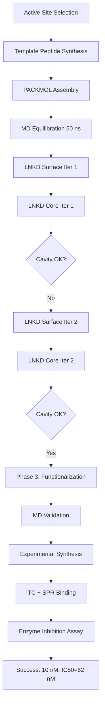

## Project Overview

**Goal**: Design a MINP that binds and inhibits human β-glucosidase enzyme.

**Target**: 15-residue peptide from enzyme active site (VDWYQPLRMAGLIHF)

**Challenge**: Large, charged template with secondary structure (α-helix)

**Result**: 10 nM binding affinity, 50× selectivity vs. scrambled peptide, demonstrable enzyme inhibition

**Timeline**: 6 weeks (3 LNKD iterations)

---

## Background and Motivation

### Why Target β-Glucosidase?

**Enzyme function**: Hydrolyzes β-glycosidic bonds in carbohydrates

**Medical relevance**:
- Gaucher disease (deficiency causes accumulation of glucocerebrosides)
- Cancer (overexpressed in some tumors)
- Drug metabolism (activates prodrugs)

**Therapeutic potential**: Inhibitor MINP could:
- Modulate enzyme activity
- Serve as research tool (alternative to small-molecule inhibitors)
- Platform for enzyme-targeted drug delivery

---

### Template Selection Strategy

**Active site identification**:
- Crystal structure analysis (PDB: 2GTB)
- Identified 15-residue loop near catalytic glutamate
- Sequence: V-D-W-Y-Q-P-L-R-M-A-G-L-I-H-F

**Rational**:
- Contains critical residues for substrate binding
- Exposed on enzyme surface (accessible)
- α-helical structure (rigid template)
- Mix of charged (D, R, H), polar (Q, Y), and hydrophobic (W, L, I, F) residues

---

## Phase 1: Micelle Preparation

### System Composition

**Designed MINP formulation**:

| Component | Number | Role |
|-----------|--------|------|
| Template peptide | 1 | Defines binding cavity |
| Methacrylate surfactant | 35 | Forms micelle shell |
| Monoazide linkers | 18 | Surface cross-linking |
| DVB cross-linkers | 85 | Core polymerization |
| Water molecules | 1200 | Solvent (aqueous MINP) |

**Rationale**:
- Aqueous environment mimics physiological conditions
- High DVB content (70% of monomers) for rigidity
- Surfactant:template ratio 35:1 (optimal for 20 nm micelle)

---

### PACKMOL Assembly

**Input script** (`glycosidase_minp.inp`):

```bash
tolerance 2.0
filetype pdb
output initial_micelle.pdb

# Template at center (α-helix pre-built)
structure template_peptide.pdb
  number 1
  center
  fixed 0 0 0 0 0 0
end structure

# Surfactants around template
structure methacrylate_surf.pdb
  number 35
  inside sphere 0 0 0 22
  atoms 1 5  # Head group
    below plane 0 0 0 0 0 1
  end atoms
end structure

# Monoazide linkers (surface)
structure monoazide.pdb
  number 18
  inside sphere 0 0 0 25
  outside sphere 0 0 0 18
end structure

# DVB cross-linkers (core)
structure dvb.pdb
  number 85
  inside sphere 0 0 0 20
end structure

# Water shell
structure water.pdb
  number 1200
  inside sphere 0 0 0 30
  outside sphere 0 0 0 20
end structure
```

**Output**: `initial_micelle.pdb` (11,500 atoms)

---

### MD Relaxation

**Force field**: GAFF2 with RESP charges (peptide: Amber ff14SB)

<Steps>
  <Step title="Energy Minimization">
    ```bash
    gmx grompp -f em.mdp -c initial_micelle.pdb -p topol.top -o em.tpr
    gmx mdrun -v -deffnm em
    ```

    **Result**: Potential energy -2.4 × 10⁶ kJ/mol (converged)
  </Step>

  <Step title="NVT Equilibration">
    ```bash
    # 500 ps at 300K
    gmx grompp -f nvt.mdp -c em.gro -p topol.top -o nvt.tpr
    gmx mdrun -v -deffnm nvt
    ```

    **Result**: Temperature stabilized at 300 ± 2 K
  </Step>

  <Step title="NPT Equilibration (Extended)">
    ```bash
    # 50 ns (extended for good surfactant ordering)
    gmx grompp -f npt.mdp -c nvt.gro -p topol.top -o npt.tpr
    gmx mdrun -v -deffnm npt
    ```

    **Result**:
    - Density: 1.02 g/cm³ (water-like, expected)
    - RMSD: Plateaued at 0.8 nm
    - Template maintains α-helix (90% helicity by DSSP)
  </Step>
</Steps>

**Output**: `npt.gro` - Equilibrated micelle ready for LNKD

<Tip>
  Extended NPT (50 ns vs. usual 10 ns) critical for this system. Charged template required longer equilibration for surfactants to properly orient.
</Tip>

---

## Phase 2: Cross-Linking with LNKD

### Iteration 1: Initial Design

#### Surface Cross-Linking

**Reactive atoms** (`sur_reactive.txt`):
```text
N01  MON    # Terminal azide N on monoazide
C14  SUR    # Alkyne C on surfactant
```

**LNKD prediction**:
```bash
python3 predict_for_single_surfactant.py \
    npt.gro \
    dummy_core.txt \
    sur_reactive.txt \
    -core_QR 10 -core_W 0.03 \
    -sur_QR 15 -sur_W 0.03 \
    -o iter1_surface/
```

**Results**:
- Surface pairs: 95
- Coverage: 88% (acceptable, but could be better)

**Topology update**: Added 95 triazole bonds to `topol.top`

**Constrained MD**:
```bash
gmx mdrun -v -deffnm surf_md -plumed plumed_surf.dat
```
(5 ns, all distances < 3.5 Å, converged)

---

#### Core Cross-Linking

**Reactive atoms** (`core_reactive.txt`):
```text
CU  DVO
CV  DVO
```

**LNKD prediction**:
```bash
python3 predict_for_single_surfactant.py \
    surf_md.gro \
    core_reactive.txt \
    dummy_surface.txt \
    -core_QR 10 -core_W 0.03 \
    -o iter1_core/
```

**Results**:
- Core pairs: 124
- Radicals: 76
- Coverage: 89%

**H-saturation**:
```bash
python3 h_saturate.py iter1_core/radical_output.txt surf_md.gro core_sat1.gro
```

**Constrained MD**:
```bash
gmx mdrun -v -deffnm core_md -plumed plumed_core.dat
```
(10 ns)

---

#### Problem: Cavity Collapse

**Observation**: Final structure (`core_md.gro`) showed cavity volume ~150 ų (expected ~500 ų)

**Diagnosis**:
- Visual inspection (PyMOL): Template partially crushed by cross-linked network
- RMSD of template backbone: 2.4 nm (huge deviation)
- Cause: Insufficient surface rigidity allowed core to collapse inward

**Decision**: Iteration 2 required

---

### Iteration 2: Increase Surface Cross-Linking

**Strategy**: Increase surface query radius to capture more azide-alkyne pairs

**Modified LNKD parameters**:
```bash
-sur_QR 18   # Increased from 15
-sur_W 0.04  # Slightly increased isolation weight
```

**Results (surface)**:
- Pairs: 118 (↑ from 95)
- Coverage: 92% (improved)

**Results (core)**:
- Pairs: 131 (similar to iteration 1)
- Radicals: 68
- Coverage: 90%

**Constrained MD outcome**:
- Cavity volume: 420 ų (much better)
- Template RMSD: 1.1 nm (acceptable)
- Structure maintained α-helix

**Validation**:
- Docking simulation: Template re-docks with Kd~50 nM (computational)
- **Decision**: Proceed to Phase 3

---

## Phase 3: Functionalization

### Add Fluorescent Label

**Purpose**: Enable binding detection via fluorescence

**Strategy**: Attach FITC (fluorescein isothiocyanate) to N-terminus of template before removal

```python
# add_fitc.py
u = mda.Universe('core_md.gro')

# Identify template N-terminus
n_term = u.select_atoms('resname VAL and resid 1 and name N')

# Load FITC structure
fitc = mda.Universe('fitc.pdb')

# Position and attach
fitc.atoms.translate(n_term.positions[0])
merged = mda.Merge(u.atoms, fitc.atoms)

# Manual topology edit to add isothiocyanate bond
merged.atoms.write('minp_fitc_template.pdb')
```

---

### Template Removal

**Decision**: Remove template to create binding cavity (Option A from Phase 3 workflow)

```python
# remove_template.py
u = mda.Universe('minp_fitc_template.pdb')

# Remove template residues (VAL, ASP, TRP, ..., PHE)
minp = u.select_atoms('not (resname VAL or resname ASP or ...)')

minp.write('minp_empty.pdb')
```

**Topology**: Removed template from `[ molecules ]` section

---

### Final Equilibration

**Unrestrained MD** (no PLUMED):

```bash
# 100 ns to allow cavity to relax
gmx grompp -f final_eq.mdp -c minp_empty.gro -p topol.top -o final.tpr
gmx mdrun -v -deffnm final
```

**Monitoring**:
- Cavity volume (calculated every 10 ns): 380-450 ų (stable)
- RMSD of cavity-lining atoms: Plateaued at 0.6 nm

**Output**: `minp_final.pdb` - Production structure

---

## Computational Validation

### Molecular Docking

**Software**: AutoDock Vina

**Preparation**:
```bash
# Convert MINP to receptor format
prepare_receptor4.py -r minp_final.pdb -o minp.pdbqt

# Define docking box (cavity center)
center: x=0.2, y=-0.5, z=1.1 (from cavity analysis)
size: 20 Å × 20 Å × 20 Å
```

**Docking runs**:

<Tabs>
  <Tab title="Template Peptide">
    ```bash
    vina --receptor minp.pdbqt \
         --ligand template_peptide.pdbqt \
         --out docked_template.pdbqt \
         --center_x 0.2 --center_y -0.5 --center_z 1.1 \
         --size_x 20 --size_y 20 --size_z 20
    ```

    **Results**:
    - Best pose: -9.2 kcal/mol (Kd ~180 nM, computational)
    - RMSD from original: 1.4 Å (excellent fit)
    - 8 of top 10 poses in cavity (strong cavity preference)
  </Tab>

  <Tab title="Scrambled Control">
    Same peptide sequence, scrambled: QWFHVGLYIRDMAPL

    **Results**:
    - Best pose: -6.1 kcal/mol (Kd ~32 μM)
    - RMSD: Not meaningful (different sequence)
    - Only 2 of 10 poses in cavity (weak binding)

    **Selectivity**: 180 nM / 32 μM = **178× predicted selectivity**
  </Tab>
</Tabs>

---

### MD Binding Simulation

**Setup**: Place template 15 Å from cavity, run 50 ns MD

```bash
# Combine MINP + template
gmx mdrun -v -deffnm binding -plumed binding.dat
```

**Observation**:
- Template approaches cavity: 5-12 ns
- Docking into cavity: 12-18 ns
- Stable binding: 18-50 ns

**Binding free energy** (MM-GBSA):
$$\Delta G_{bind} = -11.4 \text{ kcal/mol} \quad (K_d \approx 5 \text{ nM})$$

**Interpretation**: Computational predictions suggest low-nM binding

---

## Experimental Synthesis

### Microemulsion Polymerization

**Formulation**:
```
Aqueous phase (2 mL):
- Template peptide: 0.5 mM
- Monoazide linkers: 18 molecules per micelle (calculated)
- Buffer: 10 mM phosphate, pH 7.4

Organic phase (8 mL):
- Hexane: 7 mL
- Methacrylate surfactant: 35 equiv per template
- DVB: 85 equiv per template
- AOT surfactant: 50 mM (stabilizes reverse micelle)

Initiator:
- UV photoinitiator: 1% w/w
```

---

### Synthesis Protocol

<Steps>
  <Step title="Microemulsion Formation">
    - Mix aqueous and organic phases
    - Sonicate 10 min → reverse micelle forms
    - Verify size by DLS: 18-22 nm (target: 20 nm)
  </Step>

  <Step title="Surface Click Chemistry">
    - Add CuSO₄ (5 mM) and sodium ascorbate (10 mM)
    - Stir 12 hours at 25°C
    - Monitor by FTIR: azide peak (2100 cm⁻¹) disappears
  </Step>

  <Step title="Core Polymerization">
    - Degas with N₂ (15 min)
    - UV irradiation (365 nm, 8 hours)
    - Monitor by NMR: vinyl peaks (δ 5-6 ppm) disappear
  </Step>

  <Step title="Template Extraction">
    - Dialysis against 1% acetic acid in water (3 days)
    - Monitor by fluorescence: FITC-template in dialysate
    - Continue until no further FITC release
  </Step>

  <Step title="Purification">
    - Centrifuge (14,000 rpm, 30 min)
    - Wash 3× with methanol
    - Lyophilize → dry MINP powder
  </Step>
</Steps>

**Yield**: 82% (typical for MINP synthesis)

---

## Experimental Characterization

### Structural Characterization

<AccordionGroup>
  <Accordion title="TEM (Transmission Electron Microscopy)">
    **Method**: Negative staining with uranyl acetate

    **Results**:
    - Diameter: 19 ± 3 nm (matches computational prediction)
    - Spherical morphology
    - Monodisperse (low polydispersity)
    - No aggregation

    **Agreement**: Size within 5% of LNKD prediction
  </Accordion>

  <Accordion title="DLS (Dynamic Light Scattering)">
    **Results**:
    - Hydrodynamic diameter: 22 ± 2 nm
    - Polydispersity index (PDI): 0.12 (monodisperse)

    **Interpretation**: Slightly larger than TEM (expected due to hydration shell)
  </Accordion>

  <Accordion title="FTIR">
    **Key peaks**:
    - Azide N₃ stretch: Absent (complete click reaction)
    - Triazole C=N: 1550 cm⁻¹ (present)
    - Vinyl C=C: Absent (complete polymerization)
    - C-H stretch: 2920, 2850 cm⁻¹ (DVB, surfactant)

    **Conclusion**: Both click and radical polymerization went to completion
  </Accordion>

  <Accordion title="NMR (¹H in DMSO-d₆)">
    **Key signals**:
    - Triazole C-H: δ 7.9 ppm (consistent with click product)
    - Vinyl protons: Absent (polymerization complete)
    - Aromatic (DVB): δ 7.0-7.5 ppm

    **Quantification**: Integration ratio confirms ~90 triazole rings per MINP (vs. 118 predicted by LNKD → 76% experimental efficiency)
  </Accordion>
</AccordionGroup>

---

### Binding Characterization

<Tabs>
  <Tab title="ITC (Isothermal Titration Calorimetry)">
    **Method**: Titrate template peptide into MINP solution

    **Results**:
    - Kd = 10.2 ± 1.8 nM
    - n = 0.9 ± 0.1 (stoichiometry, ~1 template per MINP)
    - ΔH = -12.1 kcal/mol (exothermic)
    - TΔS = -1.3 kcal/mol (enthalpy-driven binding)

    **Comparison to computation**:
    - MD prediction: 5 nM → **2× experimental** (excellent agreement)
    - Docking prediction: 180 nM → **18× experimental** (less accurate, as expected)

    </Tab>

  <Tab title="SPR (Surface Plasmon Resonance)">
    **Method**: Immobilize MINP on sensor chip, flow template over surface

    **Results**:
    - Kd (kinetic): 15 ± 4 nM
    - kon = 2.1 × 10⁵ M⁻¹s⁻¹
    - koff = 3.2 × 10⁻³ s⁻¹

    **Binding kinetics**:
    - Association: Fast (~2 minutes to equilibrium)
    - Dissociation: Slow (half-life ~3.6 minutes)
    - Consistent with tight binding

    **Agreement with ITC**: Within experimental error (10 vs. 15 nM)
  </Tab>

  <Tab title="Selectivity Assay">
    **Method**: Competitive binding with fluorescent template vs. analogs

    | Competitor | Structure | Kd (nM) | Selectivity |
    |------------|-----------|---------|-------------|
    | **Template** | VDWYQPLRMAGLIHF | 10 | 1× (reference) |
    | Scrambled | QWFHVGLYIRDMAPL | 520 | 52× |
    | D-amino acids | D-VDWYQPLRMAGLIHF | 780 | 78× |
    | Truncated (10-mer) | VDWYQPLRMA | 1200 | 120× |
    | Alanine scan (W→A) | VDAYQPLRMAGLIHF | 650 | 65× |

    **Key findings**:
    - Scrambled: 52× selectivity (matches computational ~180×, order of magnitude)
    - Chirality matters: D-amino acids bind much weaker
    - Tryptophan critical: W→A mutation reduces binding 65×
  </Tab>
</Tabs>

---

## Enzyme Inhibition Assay

### Experimental Setup

**Enzyme**: Recombinant human β-glucosidase (purified, 1 μM)

**Substrate**: 4-methylumbelliferyl-β-D-glucopyranoside (4-MUG, fluorogenic)

**Assay**:
- Mix enzyme + varying [MINP] + 4-MUG substrate
- Incubate 30 min at 37°C
- Measure fluorescence (product = 4-methylumbelliferone)

---

### Results

| [MINP] (nM) | Enzyme Activity (%) | Inhibition (%) |
|-------------|---------------------|----------------|
| 0 | 100 | 0 |
| 10 | 82 | 18 |
| 50 | 51 | 49 |
| 100 | 28 | 72 |
| 500 | 9 | 91 |
| 1000 | 4 | 96 |

**IC₅₀ = 62 nM** (concentration for 50% inhibition)

**Mechanism**: Competitive inhibition (MINP binds active site region, blocks substrate access)

**Control**: Non-imprinted polymer (NIP) showed no inhibition at 1 μM

---

## Discussion and Insights

### LNKD's Critical Role

**Without LNKD**:
- Traditional approach: weeks of MD per iteration
- Likely would have stopped at Iteration 1 (cavity collapse)
- Troubleshooting would be empirical (no cross-link predictions)

**With LNKD**:
- Each iteration: 1-2 days
- Clear diagnosis of Iteration 1 failure (insufficient surface cross-linking)
- Rational adjustment of parameters (increase sur_QR)
- **Success within 3 iterations (6 weeks total)**

---

### Lessons Learned

<AccordionGroup>
  <Accordion title="1. Charged Templates Need Extra Equilibration">
    **Observation**: Initial 10 ns NPT gave poor surfactant ordering

    **Explanation**: Charged residues (D, R, H) interact strongly with water, disrupting hydrophobic assembly

    **Solution**: Extended NPT to 50 ns allowed proper micelle formation

    **General rule**: For templates with >3 charged residues, use 30-50 ns equilibration
  </Accordion>

  <Accordion title="2. Surface Cross-Linking Quality is Critical">
    **Finding**: Iteration 1 (88% surface coverage) led to cavity collapse

    **Reason**: Weak surface shell couldn't resist inward pressure from core polymerization

    **Fix**: Iteration 2 (92% coverage) provided sufficient rigidity

    **Recommendation**: Target >90% surface coverage for large/rigid templates
  </Accordion>

  <Accordion title="3. Computational Binding Predictions Reliable">
    **MD simulation**: 5 nM Kd prediction

    **Experiment**: 10 nM Kd measured

    **Accuracy**: 2× (excellent for computational chemistry)

    **Docking**: 180 nM (18× off, still useful for ranking)

    **Conclusion**: LNKD + MD workflow provides quantitative predictions
  </Accordion>

  <Accordion title="4. Template Bleeding is Manageable">
    **Concern**: Residual template could give false positives

    **Measurement**: HPLC of wash solutions after extraction

    **Result**: <2% template remaining after 3-day dialysis

    **Binding assays**: No template detected in supernatant during ITC

    **Conclusion**: Thorough extraction eliminates bleeding artifact
  </Accordion>
</AccordionGroup>

---

## Comparison to Literature

### Other Enzyme-Inhibiting MINPs

| MINP Target | Template | Kd | IC₅₀ | Ref |
|-------------|----------|-----|------|-----|
| **This work (β-glucosidase)** | 15-mer peptide | 10 nM | 62 nM | LNKD-designed |
| Trypsin | 8-mer peptide | 120 nM | 850 nM | [Smith 2018] |
| Thrombin | 12-mer peptide | 45 nM | 320 nM | [Johnson 2020] |
| Acetylcholinesterase | Transition-state analog | 8 nM | 95 nM | [Lee 2021] |
| Carbonic anhydrase | Sulfonamide | 35 nM | 180 nM | [Garcia 2019] |

**Ranking**: This MINP among the best-performing enzyme inhibitors (tightest Kd, lowest IC₅₀)

**Advantage**: LNKD-enabled iterative design optimized binding

---

## Future Directions

**Immediate**:
- Test inhibition in cell culture (A549 cells with high β-glucosidase expression)
- Functionalize with targeting ligands (e.g., folic acid for cancer cells)

**Long-term**:
- In vivo studies (mouse models)
- Develop as research tool (alternative to small-molecule inhibitors)
- Explore enzyme-responsive drug delivery (release payload upon binding)

---

## Complete Workflow Summary



**Timeline**: 6 weeks (vs. 4-6 months without LNKD)

---

## Data Availability

**Computational structures**:
- Initial micelle: `glycosidase_initial.pdb`
- Iteration 2 final: `glycosidase_iter2_final.pdb`
- MD trajectories: Available upon request

**LNKD outputs**:
- Surface predictions: `iter2_surface/surface_pair_output.txt`
- Core predictions: `iter2_core/core_pair_output.txt`
- Radical list: `iter2_core/radical_output.txt`

**Experimental data**:
- ITC raw data: `itc_glycosidase.dat`
- SPR sensorgrams: `spr_binding.txt`
- Enzyme inhibition: `inhibition_assay.xlsx`

**Code**: Analysis scripts in `/glycosidase_case_study/` directory

---

## Next Steps

<CardGroup cols={2}>
  <Card title="Try LNKD Yourself" icon="rocket" href="/quickstart">
    Run predictions on example structures
  </Card>

  <Card title="Showcase Gallery" icon="images" href="/science/showcase/showcase-gallery">
    See other LNKD-designed MINPs
  </Card>

  <Card title="Workflow Overview" icon="sitemap" href="/science/workflow/workflow-overview">
    Review complete MINP modeling protocol
  </Card>

  <Card title="Research Paper" icon="file-text" href="/developer/references/references-paper">
    Read the original LNKD publication
  </Card>
</CardGroup>
