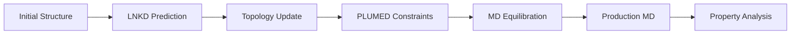

## Computational Efficiency

LNKD provides significant computational advantages through algorithmic optimization:

### Algorithmic Complexity

| Approach | Neighbor Search | Total Complexity | Scaling Behavior |
|----------|----------------|------------------|------------------|
| **Pairwise (Traditional)** | O(n²) | O(n²) | Quadratic |
| **LNKD (KD-Tree)** | O(n log n) | O(n log n) | Logarithmic |

**Key advantage**: As system size increases, LNKD's logarithmic scaling becomes increasingly favorable compared to quadratic approaches.

<Tip>
  For specific runtime benchmarks and measured speedup factors, consult the [published paper](https://pubs.acs.org/doi/10.1021/acs.jcim.5c01376).
</Tip>

### Coverage

LNKD achieves high pairing rates while enforcing chemical constraints, with unpaired radicals (6-10%) representing saturated reactive sites that cannot form additional bonds.

---

## Comparison to Existing Methods

<Tabs>
  <Tab title="vs PXLink">
    ### PXLink (Iterative MD Approach)

    **PXLink Method**:
    - Iterative distance-based pairing with MD relaxation
    - Designed for polyamide membranes in GROMACS
    - Multiple cycles of bonding + equilibration

    **Comparison**:
    | Aspect | LNKD | PXLink |
    |--------|------|--------|
    | **Complexity** | O(n log n) | O(n²) iterative |
    | **Chemistry** | Click + Radical | Amide formation |
    | **MD Integration** | Post-processing (PLUMED) | Inline topology updates |
    | **Use Case** | MINP rapid prototyping | Membrane simulation |

    **When to Use**:
    - **LNKD**: Fast structure generation, design iteration, MINPs
    - **PXLink**: High-fidelity membrane simulations requiring MD dynamics
  </Tab>

  <Tab title="vs HTPolyNet">
    ### HTPolyNet (Thermoset Network Generation)

    **HTPolyNet Method**:
    - General framework for thermoset polymers
    - Template-based reaction definitions
    - Iterative bonding with energy minimization

    **Comparison**:
    | Aspect | LNKD | HTPolyNet |
    |--------|------|-----------|
    | **Target** | MINPs | General thermosets |
    | **Approach** | KD-tree spatial indexing | Template matching |
    | **Reaction Types** | Click + Radical | User-defined templates |
    | **Complexity** | Simple parameters | Template library |

    **When to Use**:
    - **LNKD**: MINPs and dual-chemistry systems
    - **HTPolyNet**: Complex multi-step thermoset curing
  </Tab>

  <Tab title="vs REACTER">
    ### REACTER (Reactive MD Protocol)

    **REACTER Method**:
    - Template matching for complex reactions
    - Topology updates during MD
    - High-fidelity reaction pathways

    **Comparison**:
    | Aspect | LNKD | REACTER |
    |--------|------|---------|
    | **Complexity** | O(n log n) | O(n²) template matching |
    | **Approach** | Heuristic + greedy | Template-based reactive MD |
    | **Flexibility** | Fixed reactions (Click + Radical) | Arbitrary reaction templates |
    | **Use Case** | Rapid prediction | High-fidelity dynamics |

    **When to Use**:
    - **LNKD**: Known reactions, structure generation
    - **REACTER**: Complex/novel chemistry, reaction pathways
  </Tab>

  <Tab title="vs ReaxFF">
    ### ReaxFF (Reactive Force Field)

    **ReaxFF Method**:
    - Fully reactive force field simulations
    - Bond breaking/forming during MD
    - Captures reaction mechanisms

    **Comparison**:
    | Aspect | LNKD | ReaxFF |
    |--------|------|--------|
    | **Computational Cost** | Low (topology prediction) | Very high (reactive MD) |
    | **Accuracy** | Heuristic | Reaction dynamics |
    | **Complexity** | O(n log n) | Full MD simulation |
    | **Use Case** | Structure generation | Mechanism studies |

    **When to Use**:
    - **LNKD**: Initial structure for MD, design iteration
    - **ReaxFF**: Reaction mechanism investigation
  </Tab>
</Tabs>

---

## Validation

LNKD has been validated on molecularly imprinted nanoparticles with experimental binding confirmation.

<Tip>
  See [Glycosidase Case Study](/science/showcase/showcase-glycosidase) for detailed validation including predicted structures and experimental binding data.
</Tip>

---

## When to Use LNKD

LNKD is ideal for:

<AccordionGroup>
  <Accordion title="MINP Design and Optimization" icon="flask">
    **Perfect fit**: Fast iteration through design variants

    MINP workflow requires:
    - Multiple structure variants
    - Quick feedback on binding site geometry
    - Integration with docking validation

    LNKD enables practical computational MINP design.
  </Accordion>

  <Accordion title="Initial Cross-Linked Structure Generation" icon="cube">
    **Use case**: Generate starting topology for MD

    Many MD simulations need cross-linked initial structures:
    - Epoxy curing simulations
    - Hydrogel formation
    - Polymer network equilibration

    LNKD provides a chemically reasonable starting point efficiently.
  </Accordion>

  <Accordion title="High-Throughput Screening" icon="chart-line">
    **Use case**: Screen hundreds of compositions

    When speed matters more than mechanistic detail:
    - Virtual screening of monomer combinations
    - Parameter space exploration
    - Rapid prototyping

    LNKD's speed enables screening workflows.
  </Accordion>

  <Accordion title="Educational and Prototyping" icon="graduation-cap">
    **Use case**: Learn polymer simulation workflows

    LNKD's simplicity makes it ideal for:
    - Teaching cross-linking concepts
    - Prototyping new MD protocols
    - Quick validation of ideas

    No complex parameterization or template libraries required.
  </Accordion>
</AccordionGroup>

---

## When NOT to Use LNKD

Consider alternatives if you need:

<Warning>
  **Reaction Dynamics or Kinetics**

  LNKD predicts a static topology. Use ReaxFF or REACTER if you need:
  - Reaction mechanisms
  - Activation barriers
  - Polymerization kinetics
  - Time-dependent bond formation
</Warning>

<Warning>
  **Novel/Unknown Chemistry**

  LNKD supports click chemistry and radical polymerization. For other reactions:
  - Extend LNKD ([see guide](/developer/extending/extending-reactions))
  - Use template-based methods (HTPolyNet, REACTER)
</Warning>

<Warning>
  **Extreme Accuracy Requirements**

  LNKD uses heuristics. For highest-fidelity predictions:
  - Use reactive force fields (ReaxFF)
  - Run full QM/MM simulations
  - Validate experimentally
</Warning>

---

## Integration with Other Tools

LNKD complements existing workflows:

**Typical Workflow**:
1. **LNKD**: Fast cross-linking prediction
2. **Topology Update**: Add bonds to GROMACS/LAMMPS
3. **Constrained MD**: Enforce predicted bonds (PLUMED)
4. **Production MD**: Full equilibration and property analysis

<CardGroup cols={2}>
  <Card title="MINP Workflow" icon="diagram-project" href="/science/workflow/workflow-overview">
    Complete integration example
  </Card>

  <Card title="MD Integration Guide" icon="code" href="/developer/extending/extending-integration">
    GROMACS, LAMMPS, PLUMED setup
  </Card>
</CardGroup>

---

## Computational Scaling

LNKD's O(n log n) complexity provides favorable scaling characteristics:

**Key Principle**: As system size (n) increases, the speedup advantage of logarithmic scaling over quadratic approaches becomes increasingly pronounced.

**Complexity Comparison**:
- **Quadratic methods** (O(n²)): Doubling n → 4x computation time
- **LNKD** (O(n log n)): Doubling n → ~2.1x computation time

This difference becomes significant for large polymer systems with hundreds or thousands of reactive sites.

<Tip>
  For measured runtime benchmarks on specific system sizes, consult the [published paper](https://pubs.acs.org/doi/10.1021/acs.jcim.5c01376).
</Tip>

---

## Next Steps

<CardGroup cols={2}>
  <Card title="Algorithm Concepts" icon="lightbulb" href="/science/algorithm/algorithm-concepts">
    Understand KD-trees and max heaps
  </Card>

  <Card title="How It Works" icon="gear" href="/science/algorithm/how-it-works">
    Step-by-step algorithm walkthrough
  </Card>

  <Card title="Quick Start" icon="rocket" href="/quickstart">
    Try LNKD on the example system
  </Card>

  <Card title="Case Study" icon="flask" href="/science/showcase/showcase-glycosidase">
    Detailed validation results
  </Card>
</CardGroup>
