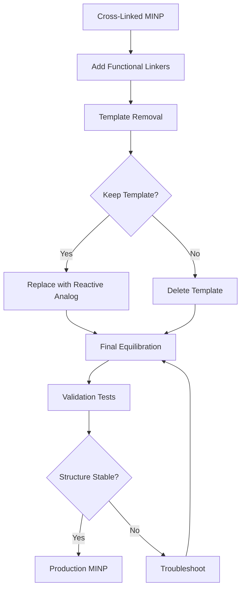

## Overview

Phase 3 transforms the cross-linked nanoparticle into a production-ready MINP with functional groups and a binding cavity.

**Goal**: Finalized structure for molecular recognition and binding studies.

**Tools**: Custom Python scripts, GROMACS, PyMOL (optional)

**Duration**: 2-5 days (mostly equilibration MD)

---

## Workflow Summary



<CardGroup cols={3}>
  <Card title="Stage 1" icon="1">
    **Functional Linkers**

    Add monoazide groups for future functionalization
  </Card>
  <Card title="Stage 2" icon="2">
    **Template Handling**

    Remove or replace template molecule
  </Card>
  <Card title="Stage 3" icon="3">
    **Equilibration**

    Unrestrained MD to finalize structure
  </Card>
</CardGroup>

---

## Stage 1: Add Functional Monoazide Linkers

### Purpose

Attach additional monoazide groups to the MINP surface for post-synthesis functionalization (e.g., fluorescent labels, biotin tags).

### Step 1: Identify Surface Attachment Sites

**Goal**: Find accessible surfactant molecules on MINP exterior.

```python
# identify_surface_sites.py
import MDAnalysis as mda
import numpy as np

# Load cross-linked MINP
u = mda.Universe('core_md.gro')

# Define MINP center
center = u.atoms.center_of_mass()

# Select surfactant terminal groups (potential attachment sites)
surfactants = u.select_atoms('resname SUR')

surface_sites = []
for residue in surfactants.residues:
    # Get terminal carbon (C20 in typical methacrylate surfactant)
    terminal = residue.atoms.select_atoms('name C20')

    if len(terminal) == 0:
        continue

    # Distance from MINP center
    dist = np.linalg.norm(terminal.positions[0] - center)

    # Surface criterion: > 15 Å from center
    if dist > 15.0:
        surface_sites.append(terminal[0].index)

print(f"Found {len(surface_sites)} surface attachment sites")

# Save for next step
with open('surface_sites.txt', 'w') as f:
    for site in surface_sites:
        f.write(f"{site}\n")
```

**Expected Output**: 20-40 surface sites

---

### Step 2: Attach Monoazide Linkers

Use molecular editing to add monoazide groups at identified sites.

<Tabs>
  <Tab title="Scripted Approach (Recommended)">
    ```python
    # attach_linkers.py
    import MDAnalysis as mda
    from MDAnalysis.topology.guessers import guess_types

    # Load structure and surface sites
    u = mda.Universe('core_md.gro')
    with open('surface_sites.txt') as f:
        sites = [int(line.strip()) for line in f]

    # Monoazide linker structure (PDB template)
    linker_template = mda.Universe('monoazide_linker.pdb')

    new_atoms = []

    for site_idx in sites:
        site_atom = u.atoms[site_idx]

        # Copy linker structure
        linker = linker_template.copy()

        # Position linker at attachment site
        # (assumes linker has attachment point at origin)
        linker.atoms.translate(site_atom.position)

        # Add to structure
        new_atoms.extend(linker.atoms)

    # Merge structures
    merged = mda.Merge(u.atoms, *new_atoms)
    merged.atoms.write('functionalized.pdb')

    print(f"Added {len(sites)} monoazide linkers")
    ```
  </Tab>

  <Tab title="PyMOL Interactive">
    **Step-by-step in PyMOL**:

    1. Load structure: `load core_md.gro`
    2. Load linker template: `load monoazide_linker.pdb`
    3. For each surface site:
       - Select attachment carbon: `select site1, id 4502`
       - Position linker: `translate [x,y,z], monoazide_linker`
       - Attach: `bond site1, monoazide_linker//A/1/C1`
    4. Save: `save functionalized.pdb`
  </Tab>
</Tabs>

---

### Step 3: Update Topology for New Linkers

Add monoazide residues to GROMACS topology.

```bash
# Generate topology for new linkers
gmx pdb2gmx -f functionalized.pdb \
            -o functionalized.gro \
            -p topol_functionalized.top \
            -ff gaff2 \
            -water tip3p
```

**Manual edits to `topol_functionalized.top`**:

```
[ moleculetype ]
; Name   nrexcl
MON      3       ; Monoazide linker

[ atoms ]
; nr  type  resnr residue atom  cgnr  charge    mass
1     c3     1    MON     C1     1    -0.123   12.01
2     n1     1    MON     N01    2    -0.345   14.01
3     n2     1    MON     N02    3     0.234   14.01
4     n1     1    MON     N03    4    -0.112   14.01

[ bonds ]
; ai  aj  funct  c0      c1
1    2    1      0.145   300000
2    3    1      0.125   450000
3    4    1      0.125   450000
```

<Accordion title="GAFF2 Parameter Reference for Azides">
  **Atom types**:
  - `c3`: sp³ carbon
  - `n1`: sp nitrogen in azide (terminal)
  - `n2`: sp² nitrogen in azide (central)

  **Bond parameters**:
  - C-N: 0.145 nm, 300,000 kJ/mol/nm²
  - N=N: 0.125 nm, 450,000 kJ/mol/nm²

  **Partial charges**: From RESP calculation (see GAFF2 documentation)
</Accordion>

---

### Step 4: Short Equilibration

Allow linkers to relax into stable conformations.

```bash
# em_linkers.mdp (energy minimization)
integrator  = steep
emtol       = 1000.0
nsteps      = 50000

# nvt_linkers.mdp (500 ps heating)
integrator  = md
dt          = 0.002
nsteps      = 250000

tcoupl      = V-rescale
tc-grps     = System
tau_t       = 0.1
ref_t       = 300
```

```bash
# Run equilibration
gmx grompp -f em_linkers.mdp -c functionalized.gro -p topol_functionalized.top -o em.tpr
gmx mdrun -v -deffnm em

gmx grompp -f nvt_linkers.mdp -c em.gro -p topol_functionalized.top -o nvt.tpr
gmx mdrun -v -deffnm nvt
```

**Output**: `nvt.gro` - Structure with relaxed functional linkers

---

## Stage 2: Template Modification/Removal

### Decision: Keep or Remove Template?

<Tabs>
  <Tab title="Option A: Remove Template (Binding Cavity)">
    **Use case**: Create empty cavity for ligand binding studies

    **Process**:
    1. Identify template residue(s) in topology
    2. Delete template atoms from structure
    3. Update topology to remove template
    4. Equilibrate to allow cavity to stabilize

    **Result**: MINP with complementary binding cavity
  </Tab>

  <Tab title="Option B: Replace Template (Reactive Analog)">
    **Use case**: Test binding with modified template for validation

    **Process**:
    1. Add reactive groups to template (e.g., fluorescent tag)
    2. Replace original template with modified version
    3. Equilibrate with new template
    4. Use for binding affinity measurements

    **Result**: MINP-template complex for validation studies
  </Tab>
</Tabs>

---

### Option A: Template Removal

#### Step 1: Identify Template in Structure

```python
# identify_template.py
import MDAnalysis as mda

u = mda.Universe('nvt.gro')

# Template is typically at center
center = u.atoms.center_of_mass()

# Find residue closest to center
min_dist = float('inf')
template_resid = None

for residue in u.residues:
    res_center = residue.atoms.center_of_mass()
    dist = np.linalg.norm(res_center - center)

    if dist < min_dist:
        min_dist = dist
        template_resid = residue.resid

print(f"Template residue ID: {template_resid}")
print(f"Template residue name: {u.residues[template_resid-1].resname}")
print(f"Template atom count: {len(u.residues[template_resid-1].atoms)}")
```

---

#### Step 2: Delete Template Atoms

```python
# remove_template.py
import MDAnalysis as mda

u = mda.Universe('nvt.gro')

# Select all atoms EXCEPT template (adjust residue name as needed)
selection = u.select_atoms('not resname TEM')

# Write structure without template
selection.write('no_template.pdb')

print(f"Removed {len(u.atoms) - len(selection)} template atoms")
print(f"Remaining atoms: {len(selection)}")
```

---

#### Step 3: Update Topology

Edit `topol_functionalized.top` to remove template molecule:

**Before**:
```
[ molecules ]
; Compound        #mols
SUR               30
DVB               80
MON               25
TEM               1     ; <-- REMOVE THIS LINE
```

**After**:
```
[ molecules ]
; Compound        #mols
SUR               30
DVB               80
MON               25
; Template removed for binding cavity
```

---

### Option B: Replace with Reactive Template

#### Step 1: Modify Template Structure

```python
# add_fluorophore_to_template.py
import MDAnalysis as mda

# Load original template
template = mda.Universe('template.pdb')

# Load fluorophore structure (e.g., FITC)
fluorophore = mda.Universe('fitc.pdb')

# Identify attachment point on template (e.g., lysine ε-amino group)
attachment_site = template.select_atoms('resid 5 and name NZ')

# Position fluorophore at attachment site
fluorophore.atoms.translate(attachment_site.positions[0])

# Merge structures
modified_template = mda.Merge(template.atoms, fluorophore.atoms)

# Add bond between template and fluorophore (manual topology edit required)
modified_template.atoms.write('template_fitc.pdb')

print("Created fluorescent template analog")
```

---

#### Step 2: Replace in MINP Structure

```python
# replace_template.py
import MDAnalysis as mda

# Load MINP and modified template
minp = mda.Universe('nvt.gro')
new_template = mda.Universe('template_fitc.pdb')

# Remove old template
minp_no_template = minp.select_atoms('not resname TEM')

# Add new template at same position
old_center = minp.select_atoms('resname TEM').center_of_mass()
new_center = new_template.atoms.center_of_mass()
translation = old_center - new_center

new_template.atoms.translate(translation)

# Merge
final = mda.Merge(minp_no_template, new_template.atoms)
final.atoms.write('minp_with_new_template.pdb')
```

Update topology to include new template residue definitions.

---

## Stage 3: Final Equilibration

### Purpose

Remove all distance restraints and allow MINP to relax into natural conformation.

<Warning>
  This is a **long** simulation (50-100 ns). Cross-linked bonds are now permanent in topology, so PLUMED constraints are no longer needed.
</Warning>

---

### Step 1: Prepare Final MD Parameters

```bash
# final_equilibration.mdp
integrator  = md
dt          = 0.002
nsteps      = 25000000    ; 50 ns (can extend to 100 ns)

; Temperature
tcoupl      = V-rescale
tc-grps     = System
tau_t       = 0.1
ref_t       = 300

; Pressure
pcoupl      = Parrinello-Rahman
tau_p       = 2.0
ref_p       = 1.0

; NO PLUMED (constraints removed)

; Output
nstxout     = 50000       ; Save every 100 ps
nstvout     = 50000
nstenergy   = 10000
nstlog      = 10000
```

<Tip>
  Increase `nsteps` to 50,000,000 for 100 ns equilibration if structure shows drift in RMSD.
</Tip>

---

### Step 2: Run Unrestrained MD

```bash
# Prepare system
gmx grompp -f final_equilibration.mdp \
           -c no_template.gro \          # or minp_with_new_template.gro
           -p topol_functionalized.top \
           -o final_eq.tpr

# Run MD (no PLUMED flag)
gmx mdrun -v -deffnm final_eq
```

**Monitor progress**:
```bash
# Check RMSD convergence
gmx rms -s final_eq.tpr \
        -f final_eq.xtc \
        -o rmsd.xvg

# Plot with xmgrace or gnuplot
xmgrace rmsd.xvg
```

---

### Step 3: Extract Final Frame

```bash
# Get last frame as final production structure
gmx trjconv -s final_eq.tpr \
            -f final_eq.xtc \
            -o minp_final.pdb \
            -dump 50000  # Last frame time (ps)
```

**Output**: `minp_final.pdb` - Production-ready MINP

---

## Validation Tests

Before using MINP for binding studies, verify structure quality.

<AccordionGroup>
  <Accordion title="Structural Stability">
    **Check**: RMSD plateau, energy convergence

    ```bash
    # RMSD over time (should plateau)
    gmx rms -s final_eq.tpr -f final_eq.xtc -o rmsd.xvg

    # Energy drift (should be minimal)
    gmx energy -f final_eq.edr -o energy.xvg
    ```

    **Good signs**:
    - RMSD < 2.0 nm after equilibration
    - No continuous upward/downward drift
    - Energy fluctuations normal (±5% around mean)
  </Accordion>

  <Accordion title="Cavity Integrity (if template removed)">
    **Check**: Binding cavity hasn't collapsed

    ```bash
    # Calculate cavity volume using MDpocket or POVME
    mdpocket -f final_eq.xtc \
             -s final_eq.tpr \
             -o cavity_analysis.pdb
    ```

    **Good signs**:
    - Cavity volume 200-800 ų
    - Shape complementary to template
    - No complete collapse

    **Visual check in PyMOL**:
    ```python
    load minp_final.pdb
    select cavity, byres (all within 6 of center)
    hide everything, cavity
    show surface, cavity
    ```
  </Accordion>

  <Accordion title="Cross-Link Distribution">
    **Check**: Uniform cross-linking, no weak regions

    ```python
    # analyze_crosslinks.py
    import MDAnalysis as mda
    import numpy as np

    u = mda.Universe('minp_final.pdb', 'topol_functionalized.top')

    # Count external bonds per DVB molecule
    crosslink_counts = []

    for residue in u.select_atoms('resname DVB').residues:
        # Count bonded neighbors outside this residue
        external_bonds = 0
        for atom in residue.atoms:
            if atom.is_bonded_external:
                external_bonds += 1
        crosslink_counts.append(external_bonds)

    print(f"Average cross-links per DVB: {np.mean(crosslink_counts):.1f}")
    print(f"Std dev: {np.std(crosslink_counts):.1f}")
    print(f"Min: {np.min(crosslink_counts)}")
    print(f"Max: {np.max(crosslink_counts)}")
    ```

    **Target**: Mean 1.5-2.0 bonds per DVB, low variance
  </Accordion>

  <Accordion title="Functional Linker Accessibility">
    **Check**: Monoazide groups on surface, not buried

    ```python
    # check_linker_accessibility.py
    import MDAnalysis as mda
    from MDAnalysis.analysis import distances

    u = mda.Universe('minp_final.pdb')

    linkers = u.select_atoms('resname MON and name N03')  # Terminal azide N
    center = u.atoms.center_of_mass()

    accessible = 0
    buried = 0

    for linker in linkers:
        dist = np.linalg.norm(linker.position - center)

        if dist > 15.0:  # Surface threshold
            accessible += 1
        else:
            buried += 1

    print(f"Accessible linkers: {accessible}")
    print(f"Buried linkers: {buried}")
    print(f"Accessibility: {100 * accessible / len(linkers):.1f}%")
    ```

    **Target**: > 70% accessibility
  </Accordion>
</AccordionGroup>

---

## Complete Phase 3 Script

Automate the entire functionalization process:

```bash
#!/bin/bash
# phase3_functionalization.sh

set -e  # Exit on error

echo "=== PHASE 3: FUNCTIONALIZATION ==="

# === STAGE 1: ADD FUNCTIONAL LINKERS ===
echo "Stage 1: Adding functional monoazide linkers..."

python3 identify_surface_sites.py core_md.gro
python3 attach_linkers.py

echo "Generating topology for functionalized structure..."
gmx pdb2gmx -f functionalized.pdb \
            -o functionalized.gro \
            -p topol_func.top \
            -ff gaff2 \
            -water tip3p

echo "Equilibrating linkers..."
gmx grompp -f em_linkers.mdp -c functionalized.gro -p topol_func.top -o em.tpr
gmx mdrun -v -deffnm em

gmx grompp -f nvt_linkers.mdp -c em.gro -p topol_func.top -o nvt.tpr
gmx mdrun -v -deffnm nvt

# === STAGE 2: TEMPLATE REMOVAL ===
echo "Stage 2: Removing template..."

python3 identify_template.py nvt.gro
python3 remove_template.py

# Update topology (manual edit required - script pauses)
echo "MANUAL STEP: Edit topol_func.top to remove template from [ molecules ]"
read -p "Press Enter when topology is updated..."

# === STAGE 3: FINAL EQUILIBRATION ===
echo "Stage 3: Final unrestrained equilibration (50 ns)..."

gmx grompp -f final_equilibration.mdp \
           -c no_template.gro \
           -p topol_func.top \
           -o final_eq.tpr

gmx mdrun -v -deffnm final_eq

# Extract final frame
gmx trjconv -s final_eq.tpr \
            -f final_eq.xtc \
            -o minp_final.pdb \
            -dump 50000 \
            <<< "0"  # Select "System"

echo "=== VALIDATION ==="

gmx rms -s final_eq.tpr -f final_eq.xtc -o rmsd.xvg
gmx energy -f final_eq.edr -o energy.xvg

python3 analyze_crosslinks.py
python3 check_linker_accessibility.py

echo "Phase 3 complete! Final structure: minp_final.pdb"
```

---

## Troubleshooting

<AccordionGroup>
  <Accordion title="Cavity collapses during equilibration">
    **Cause**: Weak cross-linking or insufficient density

    **Solutions**:
    1. Return to Phase 2, increase cross-link density
    2. Add temporary restraints to cavity-lining atoms
    3. Use shorter timestep (dt=0.001) during equilibration
    4. Reduce temperature to 280K temporarily

    **Restraint example**:
    ```bash
    # cavity_restraints.dat (PLUMED)
    # Restrain atoms lining cavity to prevent collapse

    DISTANCE ATOMS=142,587 LABEL=d1
    RESTRAINT ARG=d1 AT=1.2 KAPPA=500

    # ... for all cavity-spanning pairs
    ```
  </Accordion>

  <Accordion title="Linkers aggregate instead of distributing">
    **Cause**: Hydrophobic collapse or insufficient solvation

    **Solutions**:
    1. Add explicit solvent during linker equilibration
    2. Increase temperature briefly (350K) to disrupt aggregates
    3. Apply position restraints to MINP core while equilibrating linkers
    4. Use polar linker designs (add charged groups)
  </Accordion>

  <Accordion title="Structure distorts significantly (RMSD > 3 nm)">
    **Cause**: Unstable cross-link network or parameter errors

    **Solutions**:
    1. Check topology for incorrect bond parameters
    2. Verify all LNKD-predicted bonds are in topology
    3. Reduce equilibration timestep
    4. Return to Phase 2 and increase cross-link coverage
    5. Check for missing atoms in structure
  </Accordion>

  <Accordion title="Energy never converges">
    **Cause**: Bad contacts, incorrect charges, or topology errors

    **Solutions**:
    1. Re-run energy minimization with tighter tolerance
    2. Check for overlapping atoms (use `gmx check -f`)
    3. Verify partial charges sum to neutral
    4. Inspect topology for duplicate bonds
    5. Use steepest descent instead of conjugate gradient
  </Accordion>
</AccordionGroup>

---

## Integration with Binding Studies

The finalized MINP is now ready for molecular recognition experiments.

### Molecular Docking

**Use MINP cavity for docking studies**:

```bash
# Convert to AutoDock format
prepare_receptor4.py -r minp_final.pdb -o minp.pdbqt

# Define docking box around cavity
# (Use PyMOL to identify cavity center coordinates)

# Dock ligand (e.g., original template or analog)
vina --receptor minp.pdbqt \
     --ligand ligand.pdbqt \
     --center_x 0.0 --center_y 0.0 --center_z 0.0 \
     --size_x 20 --size_y 20 --size_z 20 \
     --out docking_results.pdbqt
```

---

### MD Binding Simulations

**Simulate ligand binding with full MD**:

```bash
# Combine MINP + ligand
# (Position ligand in cavity or outside MINP)

# Run MD with ligand
gmx grompp -f binding_md.mdp \
           -c minp_ligand_complex.gro \
           -p topol_complex.top \
           -o binding.tpr

gmx mdrun -v -deffnm binding

# Calculate binding free energy
gmx sham -f binding.xtc \
         -s binding.tpr \
         -ls gibbs.xvg \
         -g binding_energy.log
```

---

### Experimental Validation

Compare computational predictions to experiments:

<Steps>
  <Step title="Synthesize MINP">
    Follow experimental protocol matching computational design:
    - Same monomer composition
    - Same template molecule
    - Same polymerization conditions
  </Step>

  <Step title="Measure Binding Affinity">
    Use ITC, SPR, or fluorescence binding assays:
    - Determine Kd for template
    - Measure selectivity vs. analogs
  </Step>

  <Step title="Compare to Predictions">
    Computational vs. experimental:
    - Binding affinity correlation
    - Selectivity trends
    - Structural validation (NMR, SAXS)
  </Step>

  <Step title="Iterate Design">
    If mismatch exists:
    - Adjust monomer ratios
    - Modify cross-link density
    - Change functional groups
    - Re-run LNKD predictions
  </Step>
</Steps>

---

## Output Summary

**Final deliverables from Phase 3**:

| File | Description | Use |
|------|-------------|-----|
| `minp_final.pdb` | Production MINP structure | Docking, visualization |
| `final_eq.xtc` | Equilibration trajectory | Analysis, validation |
| `topol_func.top` | Complete topology | Further MD simulations |
| `rmsd.xvg` | Structural stability | Quality check |
| `cavity_analysis.pdb` | Binding cavity map | Docking box definition |

---

## Next Steps

<CardGroup cols={2}>
  <Card title="MIP Background" icon="flask" href="/science/chemistry/mip-background">
    Understand MINP synthesis chemistry
  </Card>

  <Card title="Workflow Overview" icon="sitemap" href="/science/workflow/workflow-overview">
    Review complete 3-phase protocol
  </Card>

  <Card title="Showcase: Glycosidase" icon="star" href="/science/showcase/showcase-glycosidase">
    See Phase 3 applied to real system
  </Card>

  <Card title="Extending Integration" icon="code" href="/developer/extending/extending-integration">
    Automate Phase 3 workflows
  </Card>
</CardGroup>
