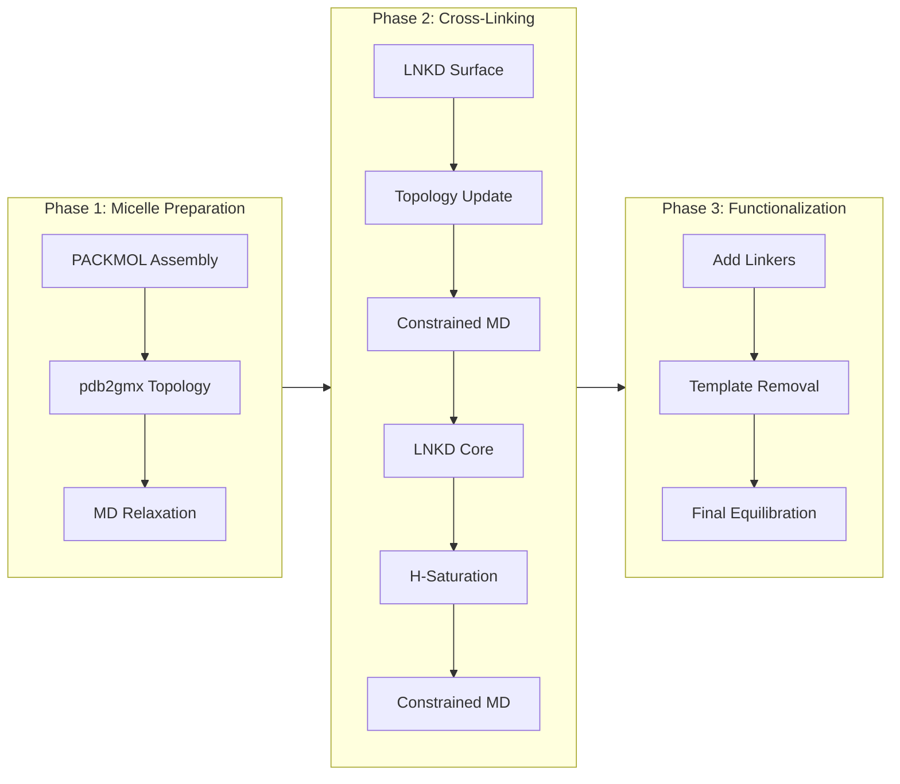
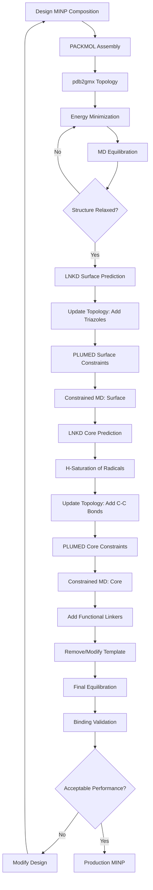

## The Complete MINP Modeling Protocol

Modeling Molecularly Imprinted Nanoparticles (MINPs) involves three distinct phases, each with specific computational tools and goals.

**LNKD's role**: Enables fast cross-linking prediction in Phase 2, removing the computational bottleneck that previously made iterative MINP design impractical.

---

## Three-Phase Overview



<CardGroup cols={3}>
  <Card title="Phase 1" icon="1">
    **Micelle Preparation**

    Assemble and equilibrate initial structure

    Tools: PACKMOL, GROMACS
  </Card>
  <Card title="Phase 2" icon="2">
    **Cross-Linking**

    Predict and enforce bonds

    Tools: LNKD, PLUMED, GROMACS
  </Card>
  <Card title="Phase 3" icon="3">
    **Functionalization**

    Add functional groups, finalize

    Tools: Custom scripts, GROMACS
  </Card>
</CardGroup>

---

## Phase 1: Micelle Preparation

**Goal**: Create an equilibrated micelle structure with template, surfactants, and cross-linkers.

### Key Steps

<Steps>
  <Step title="Assembly with PACKMOL">
    Define composition and spatial constraints:
    - Template molecule (center)
    - Surfactant molecules (around template)
    - Cross-linkers (distributed throughout)
    - Solvent (if aqueous)
  </Step>

  <Step title="Topology Generation">
    Use GROMACS `pdb2gmx` with GAFF2/RESP force field:
    - Generate topology files
    - Assign partial charges
    - Define initial bonding
  </Step>

  <Step title="MD Equilibration">
    Relax structure to realistic geometry:
    - Energy minimization
    - NVT equilibration (300K)
    - NPT equilibration (1 bar)
    - 10-50 ns relaxation
  </Step>
</Steps>

**Output**: Relaxed micelle PDB with reactive groups positioned for cross-linking.

**Typical Duration**: 1-2 days (mostly MD simulation time)

<Tip>
  Ensure reactive groups (vinyl carbons, azides, alkynes) are within 10-15 Å of potential partners after equilibration.
</Tip>

<Card title="Phase 1 Details" icon="book" href="/science/workflow/phase-1-micelle">
  Complete micelle preparation guide
</Card>

---

## Phase 2: Cross-Linking (LNKD's Role)

**Goal**: Transform micelle into cross-linked nanoparticle network.

### Two-Stage Process

MINP cross-linking involves two chemistries performed sequentially:

<Tabs>
  <Tab title="Surface Cross-Linking (First)">
    **Chemistry**: Azide-alkyne cycloaddition (click chemistry)

    **Participants**:
    - Monoazide linkers (N₃ groups)
    - Surfactant alkynes (C≡C groups)

    **LNKD Prediction**:
    ```bash
    # Surface reactive atoms defined in sur_reactive.txt
    python3 predict_for_single_surfactant.py \
        micelle_relaxed.pdb \
        sur_reactive.txt \
        -sur_QR 15 -sur_W 0.03
    ```

    **Output**: Surface pair predictions

    **MD Constraint**: PLUMED distance restraints to enforce predicted bonds

    **Duration**: LNKD prediction + 5-10 ns (constrained MD)
  </Tab>

  <Tab title="Core Cross-Linking (Second)">
    **Chemistry**: Radical polymerization

    **Participants**:
    - Vinyl carbons on DVB (divinylbenzene)
    - Vinyl carbons on methacrylate surfactants

    **LNKD Prediction**:
    ```bash
    # Core reactive atoms defined in core_reactive.txt
    python3 predict_for_single_surfactant.py \
        micelle_surface_crosslinked.pdb \
        core_reactive.txt \
        -core_QR 10 -core_W 0.03
    ```

    **Output**: Core pair predictions + radical list

    **Post-Processing**: H-saturation of unpaired radicals

    **MD Constraint**: PLUMED distance restraints

    **Duration**: LNKD prediction + 5-10 ns (constrained MD)
  </Tab>
</Tabs>

### Why This Order?

1. **Surface first**: Creates outer shell, confines interior
2. **Core second**: Densifies interior against constrained shell
3. **Chemical realism**: Matches experimental synthesis protocol

<Warning>
  Do NOT run both cross-linking steps simultaneously. The two-stage process mimics experimental conditions and produces more realistic structures.
</Warning>

**Total Phase 2 Duration**: LNKD predictions + 10-20 ns MD (~1-2 days)

<Card title="Phase 2 Details" icon="book" href="/science/workflow/phase-2-crosslinking">
  Complete cross-linking protocol with PLUMED examples
</Card>

---

## Phase 3: Functionalization

**Goal**: Add functional groups and prepare final binding-ready MINP.

### Key Steps

<Steps>
  <Step title="Add Functional Monoazide Linkers">
    Attach additional monoazide groups to surface for later functionalization.
  </Step>

  <Step title="Template Modification/Removal">
    - Option A: Remove template, leaving binding cavity
    - Option B: Replace template with reactive version for binding tests
  </Step>

  <Step title="Final Equilibration">
    Remove distance restraints and equilibrate:
    - 50-100 ns unrestrained MD
    - Allow network to relax to natural configuration
    - Check for structural stability
  </Step>
</Steps>

**Output**: Production-ready MINP structure for binding simulations.

**Total Phase 3 Duration**: 2-5 days (mostly MD)

<Card title="Phase 3 Details" icon="book" href="/science/workflow/phase-3-functionalization">
  Complete functionalization guide
</Card>

---

## LNKD's Impact on Workflow

### Before LNKD

**Phase 2 Bottleneck**:
- Iterative MD with gradual bond formation
- Manual pair selection or distance-based heuristics
- Hours to days per cross-linking iteration
- **Total Phase 2**: 1-2 weeks

**Consequence**: Exploring design variants impractical.

### With LNKD

**Phase 2 Efficiency**:
- Direct topology prediction (seconds)
- Chemically-informed pair selection
- Single MD equilibration per chemistry type
- **Total Phase 2**: 1-2 days

**Consequence**: Iterative design becomes practical - test 10-20 variants per week.

<Tip>
  LNKD reduces Phase 2 from weeks to days, enabling computational MINP design iterations that were previously infeasible.
</Tip>

---

## Workflow Timing Summary

| Phase | Steps | Wall Time | LNKD Contribution |
|-------|-------|-----------|-------------------|
| **1: Micelle** | Assembly + Equilibration | 1-2 days | - |
| **2: Cross-Linking** | Surface + Core | 1-2 days | Fast topology prediction |
| **3: Functionalization** | Linkers + Final MD | 2-5 days | - |
| **Total** | Complete MINP | **4-9 days** | Enables practical iteration |

LNKD's efficient prediction enables rapid design iteration during Phase 2.

---

## Integration with Validation

After Phase 3, typical validation steps:

<Steps>
  <Step title="Binding Simulation">
    Simulate ligand binding with final MINP:
    - Molecular docking
    - MD binding simulations
    - Calculate binding free energy
  </Step>

  <Step title="Compare to Experiment">
    Validate predictions against experimental binding data:
    - Binding affinity (Kd)
    - Selectivity ratio
    - Structural characterization
  </Step>

  <Step title="Iterate Design">
    If validation fails, modify design and repeat:
    - Adjust monomer composition
    - Change cross-link density
    - Modify template

    **With LNKD**: Can iterate 2-3 times per week
  </Step>
</Steps>

---

## Tools Required

### Software

| Tool | Purpose | Phase |
|------|---------|-------|
| **PACKMOL** | Initial assembly | 1 |
| **GROMACS** | MD simulations, topology | 1, 2, 3 |
| **LNKD** | Cross-linking prediction | 2 |
| **PLUMED** | Distance restraints | 2 |
| **PyMOL** (optional) | Visualization | All |
| **VMD** (optional) | Analysis, visualization | All |

### Computational Resources

**Minimum**:
- 8 CPU cores
- 16 GB RAM
- 100 GB storage

**Recommended**:
- 16-32 CPU cores (or GPU for GROMACS)
- 32+ GB RAM
- 500 GB storage

**LNKD Requirements**: Minimal (runs on laptop)

---

## Complete Workflow Diagram



---

## Next Steps

<CardGroup cols={2}>
  <Card title="Phase 1: Micelle Prep" icon="1" href="/science/workflow/phase-1-micelle">
    Detailed PACKMOL and equilibration guide
  </Card>

  <Card title="Phase 2: Cross-Linking" icon="2" href="/science/workflow/phase-2-crosslinking">
    LNKD integration and PLUMED constraints
  </Card>

  <Card title="Phase 3: Functionalization" icon="3" href="/science/workflow/phase-3-functionalization">
    Final preparation and validation
  </Card>

  <Card title="Try LNKD" icon="rocket" href="/quickstart">
    Run Phase 2 predictions on example data
  </Card>
</CardGroup>
